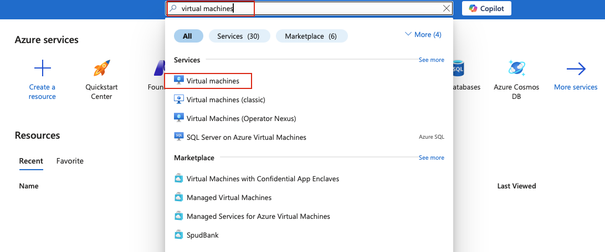
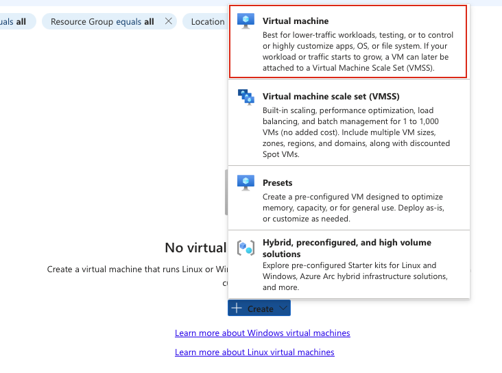
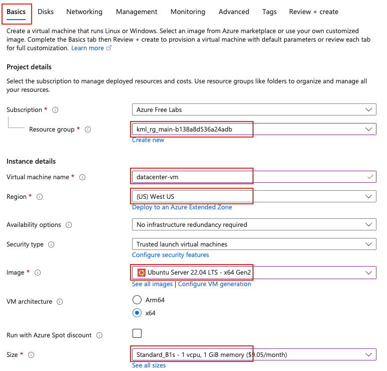
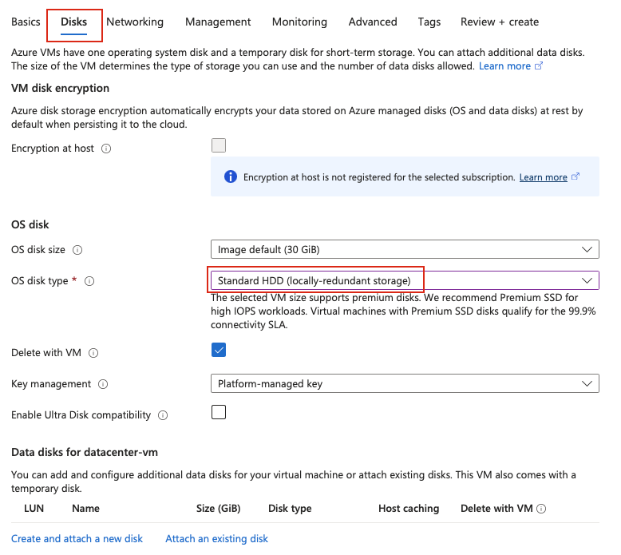
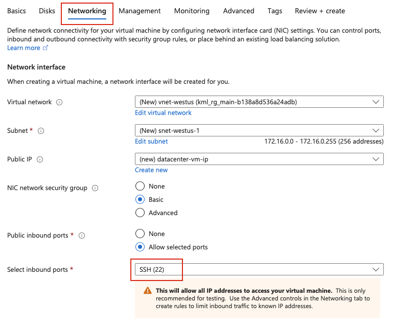

## Task: Create an Azure Virtual Machine
The Nautilus DevOps team is planning to migrate a portion of their infrastructure to the Azure cloud incrementally. As part of this migration, you are tasked with creating an Azure Virtual Machine (VM).

The requirements are:

1) Use the existing resource group.  
2) The VM name must be `datacenter-vm`, it should be in **West US** region.  
3) Use the **Ubuntu 22.04 LTS** image for the VM.  
4) The VM size must be **Standard_B1s**.  
5) Attach a default Network Security Group (NSG) that allows inbound SSH (port 22).  
6) Attach a **30 GB** storage disk of type **Standard HDD**.  
7) The rest of the configurations should remain as default.  

After completing these steps, make sure you can SSH into the virtual machine.

---

## Solution

#### **Step 1: Log in to Azure Portal**
Go to the Azure Portal:  
https://portal.azure.com  
Sign in with the credentials provided.

#### **Step 2: Search for Virtual Machines**
- In the top search bar, type **Virtual Machines**.  
- Select **Virtual Machines** from the list.  


#### **Step 3: Create a New Virtual Machine**
- Click **Create** → **Virtual Machine**.  


#### **Step 4: Fill in the Basics Section**
Provide the following values:

- **Resource Group:** Select the existing resource group  
- **Virtual machine name:** `datacenter-vm`  
- **Region:** `West US`  
- **Image:** `Ubuntu Server 22.04 LTS`  
- **Size:** Select **Standard_B1s** from the options  


You can leave other fields as default in the **Basics** section.

#### **Step 5: Configure Disk Settings**
Go to the **Disks** tab:

- **OS disk size:** Set OS disk to **30 GiB**
- **OS disk type:** Select **Standard HDD**  


#### **Step 6: Networking**
Make sure the **inbound ports** section allows **SSH(22)**.  
Keep networking settings as default (Azure automatically creates/uses VNet, subnet, and NSG if needed).  


#### **Step 7: Review and Create**
- Click **Review + create**  
- Wait for validation  
- Click **Create** to deploy the VM
- Download the private ssh key and change its permissions

```bash
chmod 400 <your_key.pem>
```

Azure will now provision the Virtual Machine.

#### **Step 8: SSH into the VM**
Once deployment completes:

1. Go to **Virtual Machines → datacenter-vm**  
2. Copy the public IP address  
3. SSH into the VM from a terminal:

```bash
ssh -i <your_key.pem> <username>@<PublicIP>
```