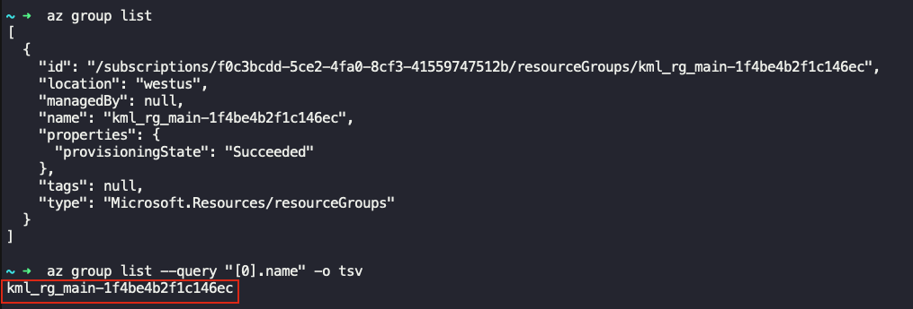
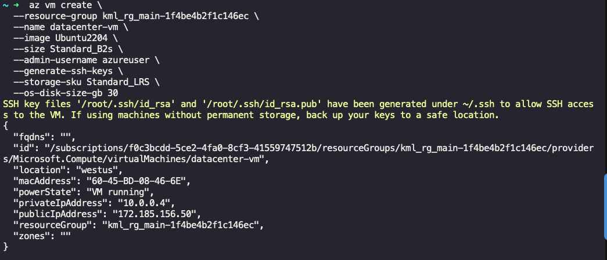
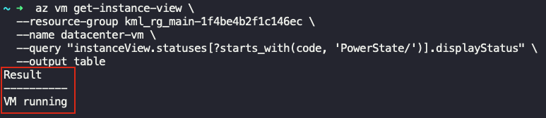

## Task
The Nautilus DevOps team is in the process of migrating some of their workloads to Azure. One of the tasks involves creating a new Virtual Machine (VM) using the Azure CLI. The team does not have access to the Azure portal but can manage Azure resources via the `azure-client` host (the landing host for this lab).

1) Create a new Azure Virtual Machine named `datacenter-vm` using the Azure CLI.  
2) Use the **Ubuntu 22.04 (Ubuntu2204)** image and set the VM size to **Standard_B2s**.  
3) Set the admin username to **azureuser** and generate SSH keys for secure access.  
4) Use **Standard_LRS** storage, configure the OS disk to **30GB**, and ensure the VM is in a **running** state after creation.

---

## Solution

#### **Step 1: Fetch the existing Resource group name**
On the `azure-client` host:

```bash
az group list
```
Gives details of the existing groups. We would only need the `name` of the group.  
OR you can run the following command to get just the `name`.  
```bash
az group list --query "[0].name" -o tsv
```
 

#### **Step 2: Create VM using Azure CLI**
Replace `<existing_resource_group_name>` with the `name` that you've got in the previous step. Also make sure other details are set as per the task requirements.
```bash
az vm create \                         
  --resource-group <existing_resource_group_name> \
  --name datacenter-vm \
  --image Ubuntu2204 \
  --size Standard_B2s \
  --admin-username azureuser \
  --generate-ssh-keys \
  --storage-sku Standard_LRS \
  --os-disk-size-gb 30
```
 

#### **Step 3: Verify VM state**
Verify whether the VM is running or not.
```bash
az vm get-instance-view \
  --resource-group <your-existing-rg> \
  --name datacenter-vm \
```
 