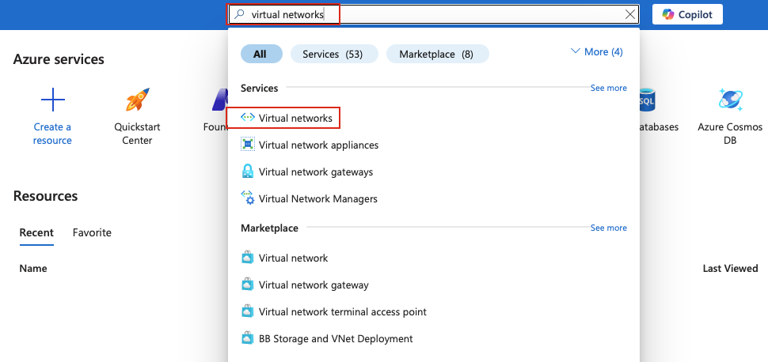
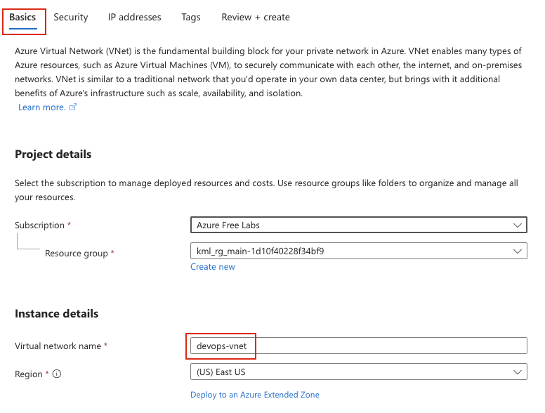
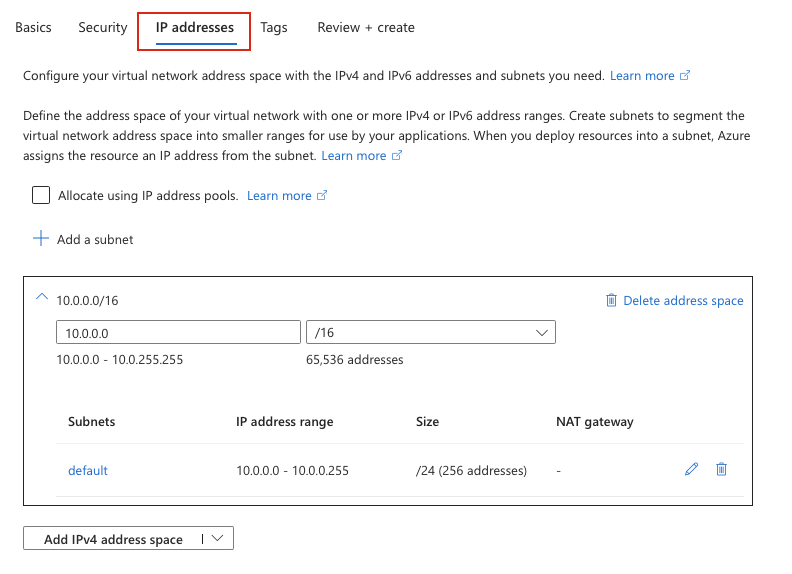
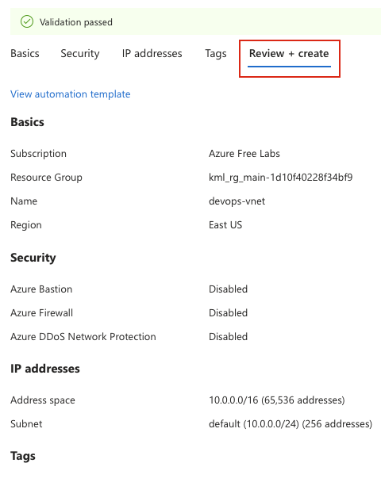

## Task
The Nautilus DevOps team is strategizing the migration of a portion of their infrastructure to the Azure cloud. Recognizing the scale of this undertaking, they have opted to approach the migration in incremental steps rather than as a single massive transition. To achieve this, they have segmented large tasks into smaller, more manageable units. This granular approach enables the team to execute the migration in gradual phases, ensuring smoother implementation and minimizing disruption to ongoing operations.

Create a Virtual Network (VNet) named `devops-vnet` in the `East US` region with any `IPv4` CIDR block.

---

## Solution

#### **Step 1: Log in to Azure Portal**
Go to the Azure Portal:  
https://portal.azure.com  
Sign in with the credentials provided.

#### **Step 2: Search for Virtual Networks**
- In the top search bar, type **Virtual Networks**.  
- Select **Virtual Networks** from the list.  

#### **Step 3: Create a New Virtual Network**
- Click **Create** 

#### **Step 4: Fill in the Basics Section**
Provide the following values:
  
- **Resource Group:** Select an existing resource group or create a new one  
- **Virtual network name:** `devops-vnet`  
- **Region:** `East US`  

#### **Step 5: Configure IP Address Space**
In the **IP Addresses** tab:

- **IPv4 address space:** Use the default CIDR block (e.g., `10.0.0.0/16`) or specify your own IPv4 CIDR block  
- **Subnet:** A default subnet will be created automatically (e.g., `default` with `10.0.0.0/24`)  

You can keep the default subnet settings or modify as needed.  

#### **Step 6: Review and Create**
- Review all the configuration settings  
- Click **Review + create**  
- Wait for validation to complete  
- Click **Create** to deploy the Virtual Network  

Azure will now provision the Virtual Network.