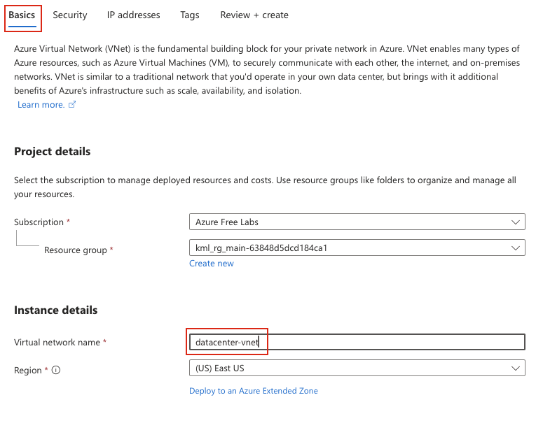
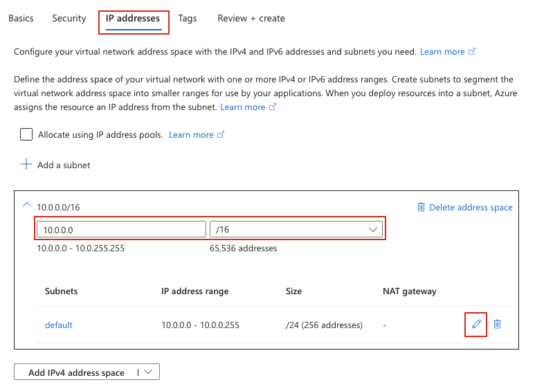

## Task: Create a Subnet in Azure Virtual Network
The Nautilus DevOps team is strategizing the migration of a portion of their infrastructure to the Azure cloud. Recognizing the scale of this undertaking, they have opted to approach the migration in incremental steps rather than as a single massive transition.

For this task, create a Virtual Network (VNet) named `datacenter-vnet` and one subnet named `datacenter-subnet` within the VNet in the `East US` region. Make sure the `IPv4 address range` is `10.0.0.0/16`.

---

## Solution

#### **Step 1: Log in to Azure Portal**
Go to the Azure Portal:  
https://portal.azure.com  
Sign in with the credentials provided.

#### **Step 2: Search for Virtual Networks**
- In the top search bar, type **Virtual Networks**.  
- Select **Virtual Networks** from the list.  

#### **Step 3: Create a New Virtual Network**
- Click **Create** 

#### **Step 4: Fill in the Basics Section**
Provide the following values:
  
- **Resource Group:** Select an existing resource group or create a new one  
- **Virtual network name:** `datacenter-vnet`  
- **Region:** `East US`  

#### **Step 5: Configure IP Address Space**
In the **IP Addresses** tab:

- **IPv4 address space:** Specify `10.0.0.0/16` IPv4 CIDR block  
- **Subnet:** Edit the default subnet name to `datacenter-subnet` or create a new subnet under this vnet  
  

#### **Step 6: Review and Create**
- Review all the configuration settings  
- Click **Review + create**  
- Wait for validation to complete  
- Click **Create** to deploy the Virtual Network  

Azure will now provision the Virtual Network and Subnet.