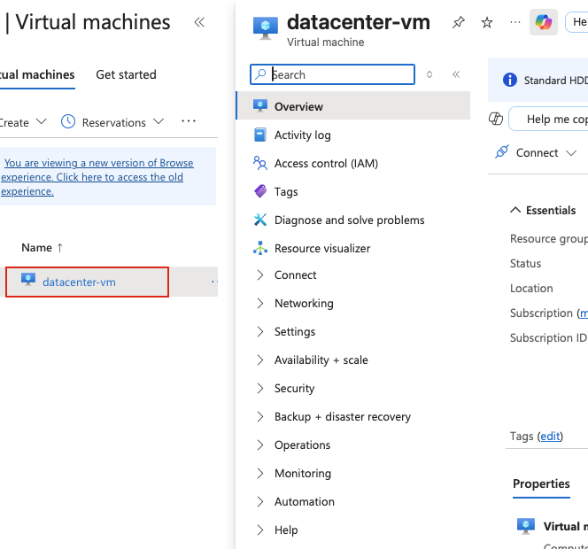
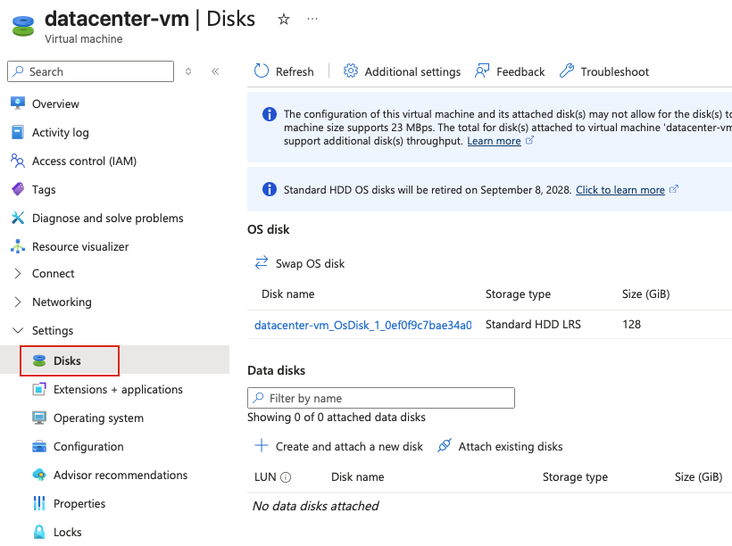
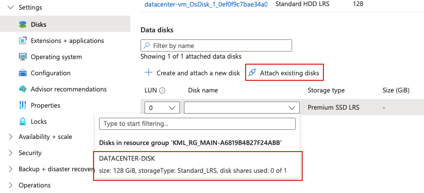
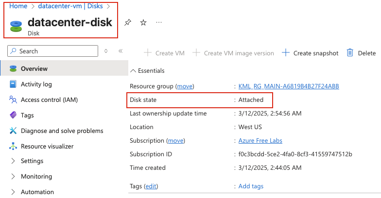
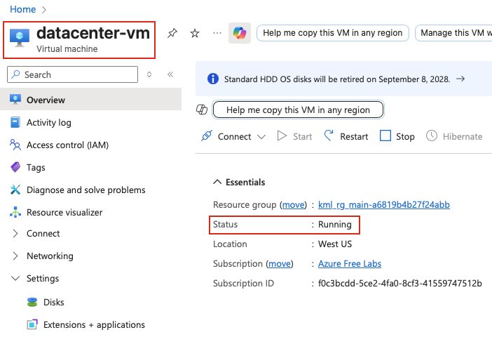

## Task
The Nautilus DevOps team is migrating services to Azure. They are breaking down tasks to ensure better control and optimization. You are tasked with attaching an existing data disk to a virtual machine (VM).

An existing VM named `datacenter-vm` and a managed disk named `datacenter-disk` already exist in the East US region.

- Attach the disk `datacenter-disk` to the VM `datacenter-vm` as a data disk.
- Ensure the disk is attached to the VM datacenter-vm.

Make sure that the virtual machine initialization has been completed before submitting this task.

---

## Solution

#### **Step 1: Log in to Azure Portal**
Go to the Azure Portal:  
https://portal.azure.com  
Sign in with the credentials provided.

#### **Step 2: Search for Virtual Machines**
- In the top search bar, type **Virtual Machines**.  
- Select **Virtual Machines** from the list.  

#### **Step 3: Select the Virtual Machine**
- From the list of virtual machines, locate and click on **datacenter-vm**.  

#### **Step 4: Navigate to Disks Section**
- In the left-hand menu under **Settings**, click on **Disks**.  

#### **Step 6: Select and attach the Existing Disk**
In the data disk configuration:

- In the **Data disks** section, click on **Attach existing disks**.  
- **Disk name:** Click on the dropdown and select **datacenter-disk** from the list of available managed disks  

#### **Step 7: Save the Configuration**
- Click **Apply** to attach the disk to the VM.  

**Note:** The VM may need to restart or the operation may take a few moments to complete.

#### **Step 8: Verify Disk Attachment**
Once the operation completes:

1. Stay on the **Disks** page of **datacenter-vm**  
2. Verify that **datacenter-disk** appears under the **Data disks** section  
3. Check that the disk status shows as **Attached**  

#### **Step 9: Verify VM State**

- Go to **Virtual Machines** → **datacenter-vm** → **Overview**  
- Confirm **datacenter-vm** is in **running** state
