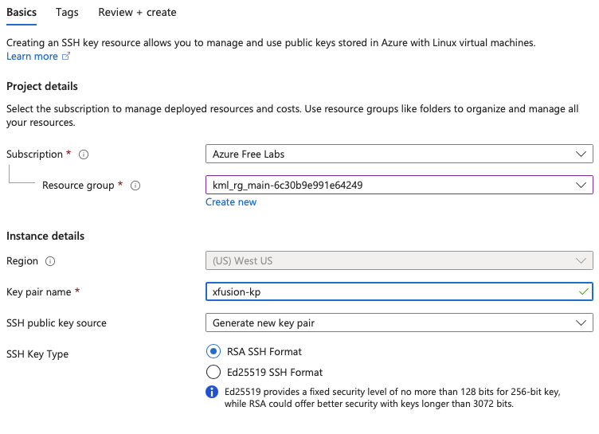

## Task
The Nautilus DevOps team is strategizing the migration of a portion of their infrastructure to the Azure cloud. Recognizing the scale of this undertaking, they have opted to approach the migration in incremental steps rather than as a single massive transition. To achieve this, they have segmented large tasks into smaller, more manageable units. This granular approach enables the team to execute the migration in gradual phases, ensuring smoother implementation and minimizing disruption to ongoing operations. By breaking down the migration into smaller tasks, the Nautilus DevOps team can systematically progress through each stage, allowing for better control, risk mitigation, and optimization of resources throughout the migration process.

For this task, create an SSH key pair with the following requirements:

The name of the SSH key pair should be xfusion-kp.

The key pair type must be rsa.

---
## Solution
#### **Step 1: Log in to Azure Portal**
Go to the Azure Portal:  
https://portal.azure.com  
Sign in with the credentials provided.

#### **Step 2: Navigate to SSH Keys**
- In the top search bar, type **SSH keys**.
- Select **SSH keys** from the Services list.

#### **Step 3: Create a New SSH Key**
- Click **Create** at the top of the SSH keys page.

#### **Step 4: Fill in the Basics Section**
Provide the following values:

- **Resource Group:** Select an existing one 
- **Key pair name:** `xfusion-kp`
- **SSH Key Type:** Select `RSA SSH Format`

You can leave other fields as default.

#### **Step 5: Review and Create**
- Click **Review + create**.
- After validation, click **Create**.

Azure will now generate the SSH key pair.