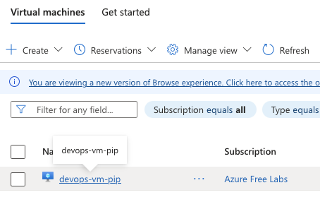
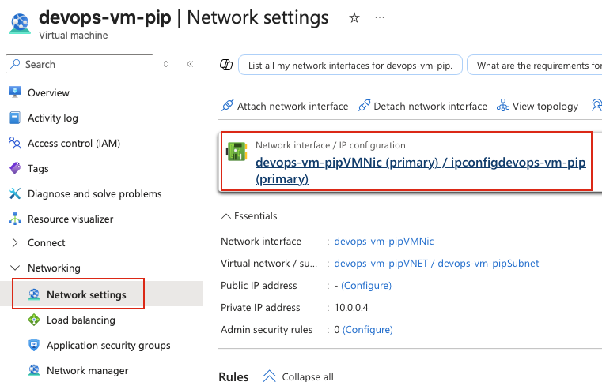
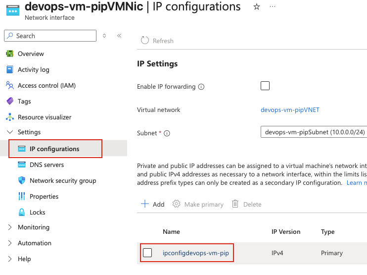
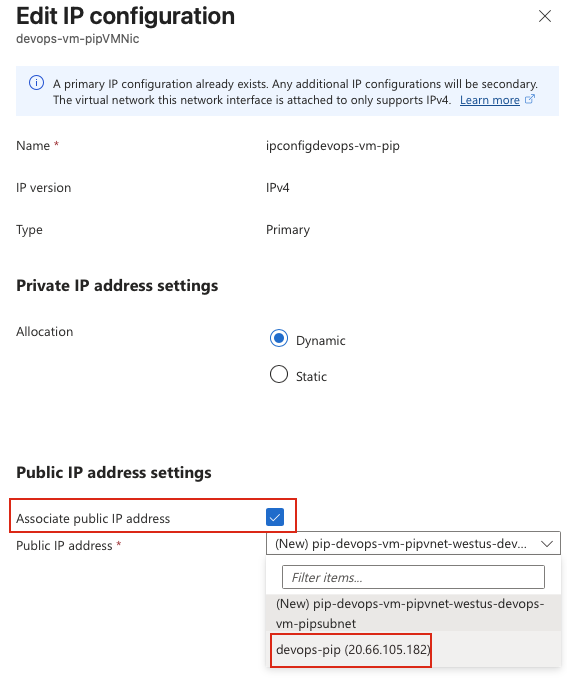
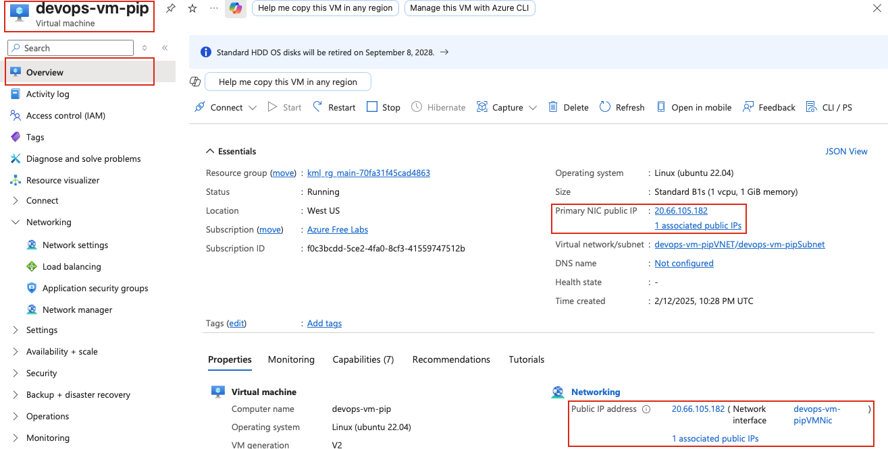

## Task: Attach Public IP to Azure Virtual Machine
The Nautilus DevOps team has already set up a virtual machine and allocated a public IP address. The final task is to attach this public IP to the VM's network interface card (NIC).

An existing VM named `devops-vm-pip` and a public IP address named devops-pip already exist.

Attach the public IP `devops-pip` to the network interface of the VM `devops-vm-pip`.
Make sure the VM is properly assigned the public IP.

---

## Solution

#### **Step 1: Log in to Azure Portal**
Go to the Azure Portal:  
https://portal.azure.com  
Sign in with the credentials provided.

#### **Step 2: Search for Virtual Machines**
- In the top search bar, type **Virtual Machines**.  
- Select **Virtual Machines** from the list.  

#### **Step 3: Select the Virtual Machine**
- From the list of virtual machines, locate and click on **devops-vm-pip**.  

#### **Step 4: Navigate to Networking Section**
- In the left-hand menu under **Networking**, click on **Network settings**.  
- Identify the **Network Interface** attached to the VM.  
- Click on the **Network Interface** name to open its settings.  

#### **Step 5: Access and edit Network Interface Settings**
You will be redirected to the Network Interface resource page.

- In the left-hand menu under **Settings**, click on **IP configurations**.  
- You will see a list of IP configurations.  
- Click on the IP configuration name to edit it.  

#### **Step 6: Associate Public IP Address**
In the IP configuration settings:

- Under **Public IP address settings**, check the option **Associate public IP address**.  
- **Public IP address:** Click on the dropdown and select **devops-pip** from the list of available public IP addresses.  

#### **Step 8: Save the Configuration**
- Click **Save** to apply the changes.  

**Note:** The operation may take a few moments to complete. Azure will associate the public IP address with the VM's network interface.

#### **Step 9: Verify Public IP Assignment**
Once the operation completes:

- Go back to **Virtual Machines** → **devops-vm-pip**  
- On the **Overview** page, check the **Public IP address** field  
- Verify that it now shows the IP address from **devops-pip**  

**Important Notes:**
- A public IP can only be associated with one resource at a time
- The VM does not need to be stopped to attach a public IP
- Ensure the Network Security Group (NSG) rules allow traffic on the required ports (e.g., SSH port 22, RDP port 3389)
- The public IP assignment can be **Static** or **Dynamic** depending on the public IP configuration