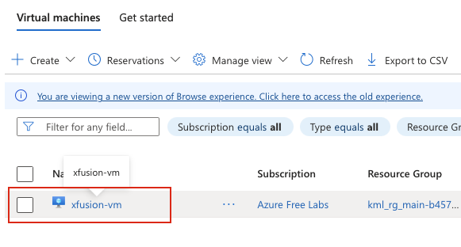
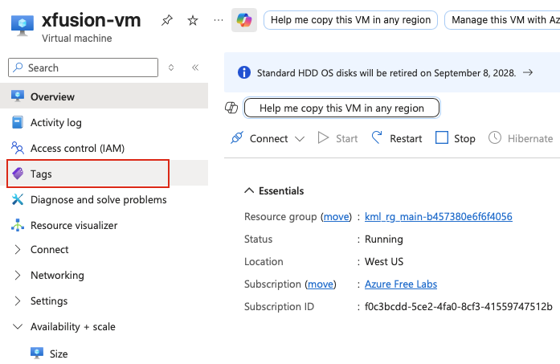
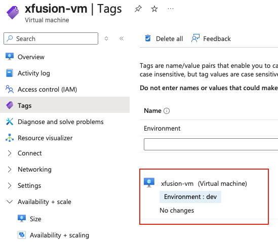

## Task: Add and Manage Tags for Azure Virtual Machines
The Nautilus DevOps team is migrating a portion of their infrastructure to Azure. During the migration, they have created several virtual machines (VMs) in different regions. The team has identified one VM that is not tagged properly so they decided to tag it as needed.

Add the tag `Environment=dev` to the virtual machine named `xfusion-vm`.

---

## Solution

#### **Step 1: Log in to Azure Portal**
Go to the Azure Portal:  
https://portal.azure.com  
Sign in with the credentials provided.

#### **Step 2: Search for Virtual Machines**
- In the top search bar, type **Virtual Machines**.  
- Select **Virtual Machines** from the list.  

#### **Step 3: Select the Virtual Machine**
- From the list of virtual machines, locate and click on **xfusion-vm**.  

#### **Step 4: Navigate to Tags Section**
- In the left-hand menu click on **Tags**.  

#### **Step 5: Add New Tag**
In the Tags page:
- **Name:** Enter `Environment`  
- **Value:** Enter `dev`  
- Click **Apply** to apply the tag.  

#### **Step 6: Verify Tag Assignment**
Once the save operation completes:
- Stay on the **Tags** page of **xfusion-vm**  
- Verify that the tag **Environment: dev** appears in the list of tags  
- You should see a confirmation notification indicating the tag was saved successfully  

