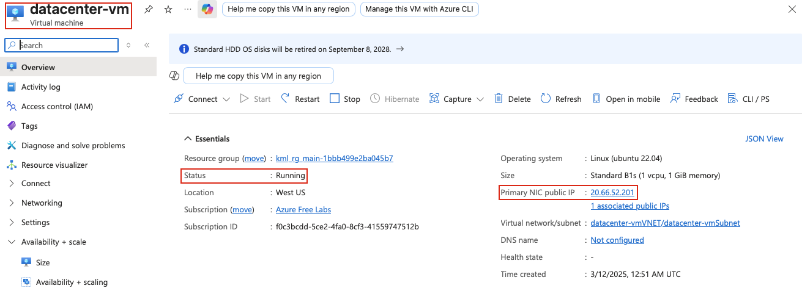
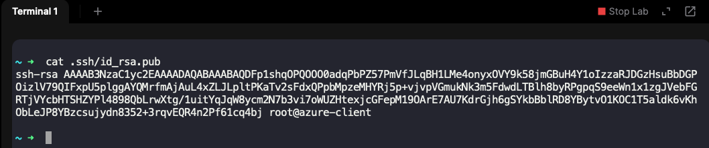
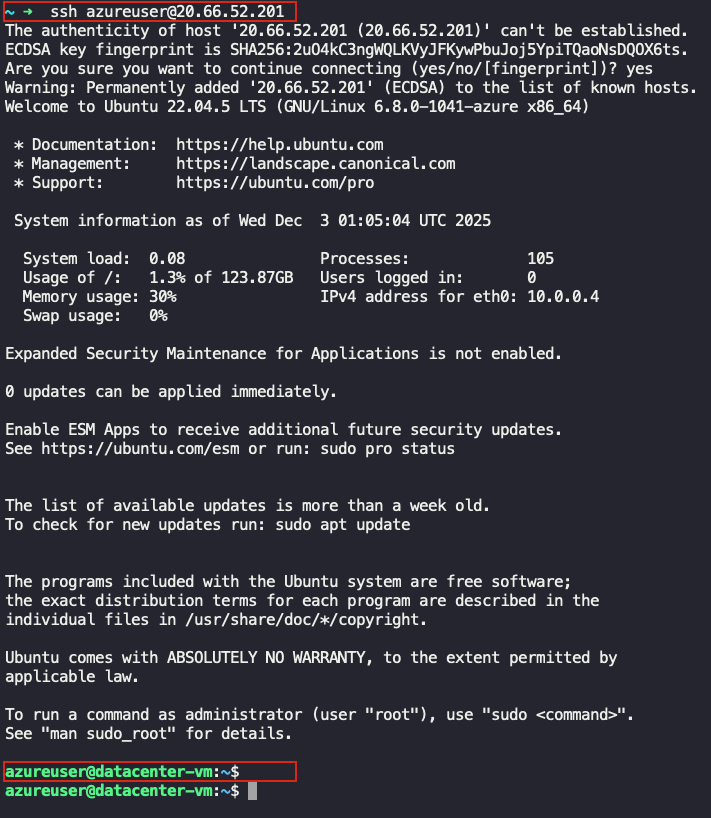
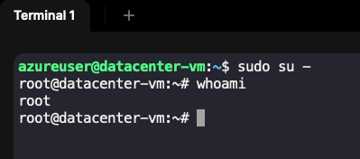
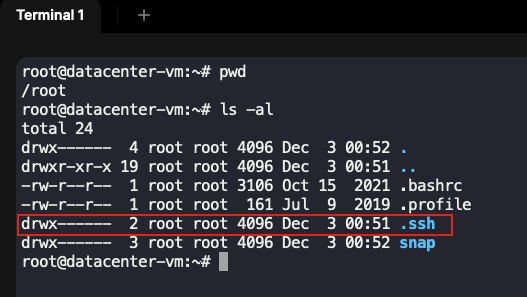
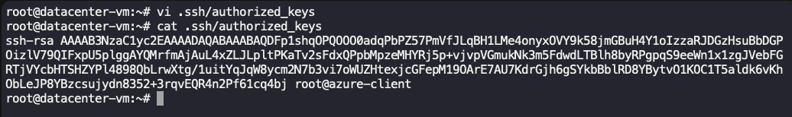
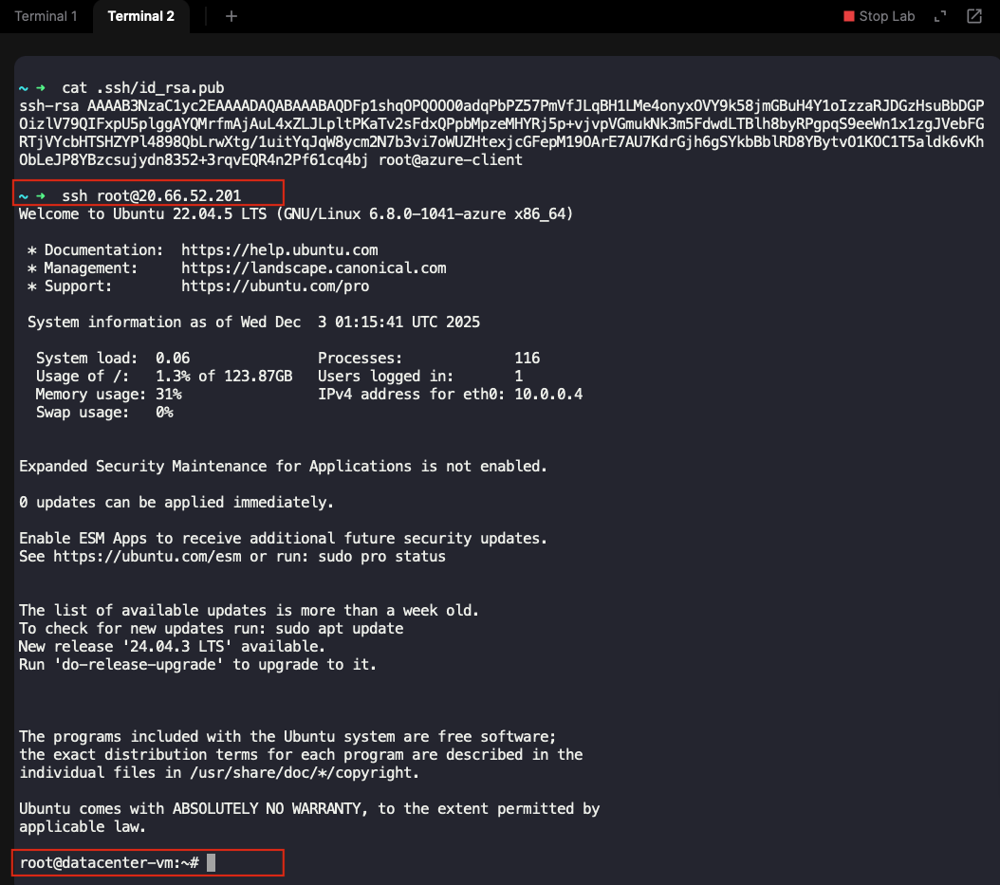

## Task: SSH into an Azure Virtual Machine
The Nautilus DevOps team is working on setting up secure SSH access for their virtual machines in Azure. One of the requirements is to add the SSH public key of the root user from the Azure client host (landing host) to the `datacenter-vm` Azure VM's `authorized_keys` file. This ensures secure and password-less SSH access to the VM.

#### Task Details:
1. **VM Details:**
- The VM is named `datacenter-vm` and is running in the `West US` region. The default SSH user is `azureuser` — use this user to connect to the VM.
- You need to add the root user's SSH public key from the Azure client host to the `authorized_keys` file of the VM's root user.
- The SSH public key of the root user on the Azure client host is located at `/root/.ssh/id_rsa.pub`.
2. **Public Key Addition:**
- Copy the public key located at `/root/.ssh/id_rsa.pub` on the Azure client host to the `authorized_keys` file of the root user on `datacenter-vm`.
- Ensure that the proper permissions for the `.ssh` folder and `authorized_keys` file are set on the VM.
3. **Verification:**
- After adding the public key, make sure that you are able to SSH into the `datacenter-vm` VM as the `root` user from the Azure client host without needing a password.

#### Important Notes:
- Ensure that the VM is up and running before attempting to SSH.
- You may need to adjust the firewall or security group rules for the VM to allow SSH access.

---

## Solution

#### **Step 1: Verify VM is Running**

First, ensure that the `datacenter-vm` is in a running state.

- Go to the Azure Portal: https://portal.azure.com
- Navigate to **Virtual Machines**
- Click on **datacenter-vm**
- Verify the **Status** shows **Running**
- Note the **Public IP address** of the VM  


#### **Step 2: Copy the SSH public key from Azure Client Host**

Check if the SSH public key exists on the Azure client host.
```bash
cat /root/.ssh/id_rsa.pub
```


#### **Step 3: SSH into the VM as azureuser**

Connect to the `datacenter-vm` using the `azureuser` account.
```bash
# SSH into the VM (replace <PUBLIC_IP> with the actual public IP)
ssh azureuser@<PUBLIC_IP>
```


#### **Step 4: Switch to Root User on the VM**

Once logged in as `azureuser`, switch to the root user.
```bash
sudo su -
```


#### **Step 5: Create .ssh Directory for Root (if not exists)**

Ensure the `.ssh` directory exists for the root user with proper permissions.
```bash
# Create .ssh directory if it doesn't exist
mkdir -p /root/.ssh

# Set proper permissions for .ssh directory
chmod 700 /root/.ssh
```


#### **Step 6: Add Public Key to authorized_keys**

Add the root user's public key from the Azure client host to the `authorized_keys` file.
```bash
vi /root/.ssh/authorized_keys
```


Paste the public key content (from Step 4) into this file. Each key should be on a separate line.

#### **Step 7: Set Proper Permissions for authorized_keys**

Ensure the `authorized_keys` file has the correct permissions.
```bash
# Set permissions for authorized_keys file
chmod 600 /root/.ssh/authorized_keys

# Ensure root owns the files
chown root:root /root/.ssh/authorized_keys
```

#### **Step 10: Verify SSH as root**

Check if you are able to SSH to the `datacenter-vm` vm as `root` user. From the Azure client host terminal:  
```bash
ssh root@<PUBLIC_IP>
```

