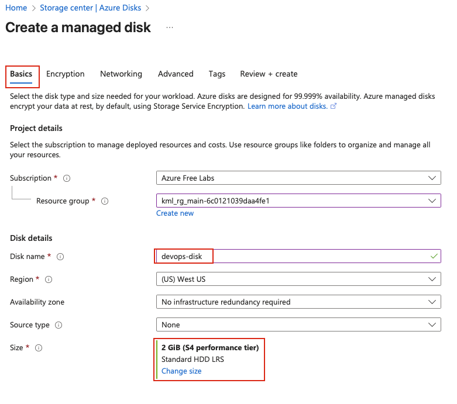
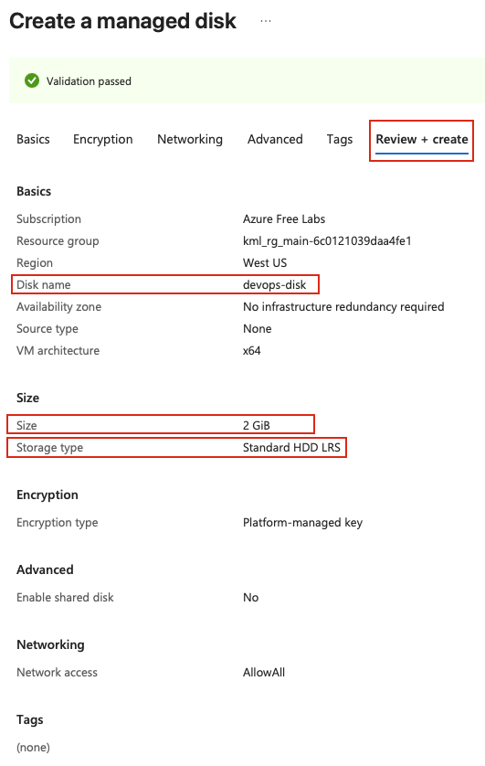
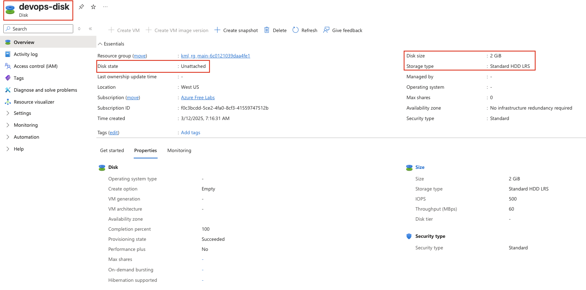

## Task: Create and Attach Managed Disks in Azure
The Nautilus DevOps team is strategizing the migration of a portion of their infrastructure to the Azure cloud. Recognizing the scale of this undertaking, they have opted to approach the migration in incremental steps rather than as a single massive transition. To achieve this, they have segmented large tasks into smaller, more manageable units. This granular approach enables the team to execute the migration in gradual phases, ensuring smoother implementation and minimizing disruption to ongoing operations. By breaking down the migration into smaller tasks, the Nautilus DevOps team can systematically progress through each stage, allowing for better control, risk mitigation, and optimization of resources throughout the migration process.

Create a managed disk with the following requirements:

- Name of the disk should be `devops-disk`.
- Disk `type` must be `Standard_LRS`.
- Disk `size` must be `2 GiB`.

---

## Solution

#### **Step 1: Log in to Azure Portal**
Go to the Azure Portal:  
https://portal.azure.com  
Sign in with the credentials provided.

#### **Step 2: Search for Disks**
- In the top search bar, type **Disks**.  
- Select **Disks** from the list.  

#### **Step 3: Create a New Managed Disk**
- Click **Create** 

#### **Step 4: Fill in the Basics Section**
Provide the following values:

- **Resource Group:** Select an existing resource group  
- **Disk name:** `devops-disk`  
- **Size:** Click on **Change size**  
  - A side panel will open showing different disk options  
  - Select **Standard HDD (locally-redundant storage)**  
  - In the size dropdown or input field, select or enter `2 GiB`  
  - The disk type will be shown as **Standard_LRS**  
  - Click **OK** to confirm the size selection  

  

Leave other options as default.

**Disk Type Details:**
- **Standard_LRS:** Standard HDD with Locally Redundant Storage
- **LRS:** Data is replicated three times within a single datacenter
- **Use Case:** Cost-effective storage for infrequently accessed data

#### **Step 5: Review and Create**
- Review all the configuration settings:
  - **Disk name:** devops-disk
  - **Size:** 2 GiB
  - **Disk type:** Standard_LRS
- Click **Review + create**  
- Wait for validation to complete  
- Click **Create** to provision the managed disk  

Azure will now create the managed disk.

#### **Step 6: Verify Disk Creation**
Once deployment completes:

- Go to **Disks** from the Azure Portal  
- Locate and click on **devops-disk**  
- Verify the following details:
   - **Name:** devops-disk  
   - **Size:** 2 GiB  
   - **Disk type:** Standard HDD (LRS)  
   - **Disk state:** Unattached (since it's not attached to any VM yet)  

**Important Considerations:**
- **Disk State:** The disk will initially be in an "Unattached" state until you attach it to a VM
- **Minimum Size:** Azure managed disks have size tiers; 2 GiB is a valid small disk size
- **Billing:** You are charged for the disk even when it's not attached to a VM
- **Snapshots:** You can create snapshots of managed disks for backup purposes
- **Encryption:** All Azure managed disks are encrypted at rest by default

**Disk Redundancy Options:**
- **LRS (Locally Redundant Storage):** 3 copies within a single datacenter
- **ZRS (Zone-Redundant Storage):** Copies across multiple availability zones
- **GRS (Geo-Redundant Storage):** Copies to a secondary region (not available for managed disks directly)