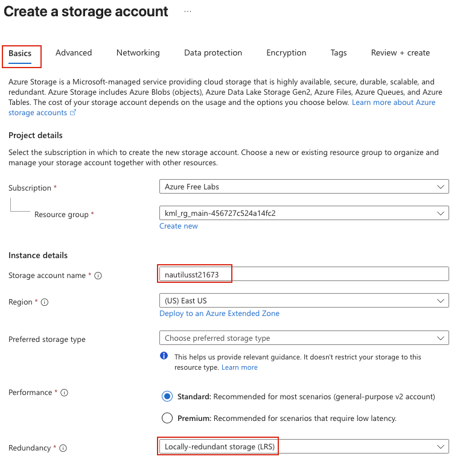
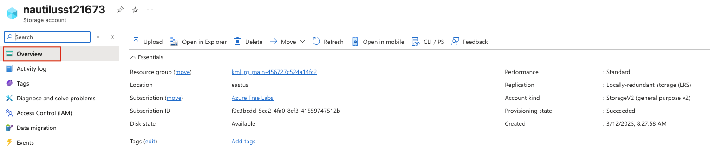
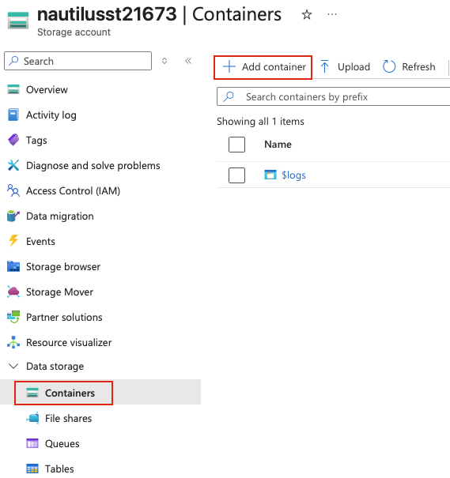
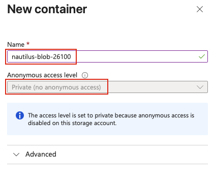
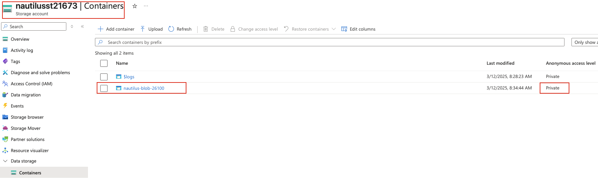

## Task: Create a Private Azure Blob Storage Container
As part of the data migration process, the Nautilus DevOps team is actively creating several storage containers on Azure. They plan to utilize private Blob containers to store the relevant data. Given the ongoing migration of other infrastructure to Azure, it is logical to consolidate data storage within the Azure environment as well.

Create a new storage account named `nautilusst21673` and a `private` Blob container named `nautilus-blob-26100` within the storage account.

---

## Solution

#### **Step 1: Log in to Azure Portal**
Go to the Azure Portal:  
https://portal.azure.com  
Sign in with the credentials provided.

#### **Step 2: Search for Storage Accounts**
- In the top search bar, type **Storage accounts**.  
- Select **Storage accounts** from the list.  

#### **Step 3: Create a New Storage Account**
- Click **Create** 

#### **Step 4: Fill in the Basics Section**
Provide the following values:

- **Resource Group:** Select an existing resource group  
- **Storage account name:** `nautilusst21673`     
- **Redundancy:** `Locally-redundant storage (LRS)`  

Leave other options as default.

#### **Step 5: Review and Create Storage Account**
- Review all the configuration settings  
- Click **Review + create**  
- Wait for validation to complete  
- Click **Create** to provision the storage account  

Azure will now create the storage account. This may take a few moments.

#### **Step 6: Verify Storage Account Creation**
Once deployment completes:

- Click **Go to resource** or navigate to **Storage accounts**  
- Locate and click on **nautilusst21673**  
- Verify the storage account details on the **Overview** page  

#### **Step 7: Navigate to Containers**
From the **nautilusst21673** storage account page:

- In the left-hand menu under **Data storage**, click on **Containers**.  

#### **Step 8: Create a New Container**
Click **Add container** at the top of the page. In the **New container** panel, provide the following values:

- **Name:** `nautilus-blob-26100`  
- **Anonymous access level:** **Private (no anonymous access)**  
- Click **Create** to create the blob container  

The container will be created immediately.

**Public Access Level Options:**
- **Private (no anonymous access):** No public read access (most secure)
- **Blob (anonymous read access for blobs only):** Blobs can be read anonymously
- **Container (anonymous read access for containers and blobs):** Full anonymous read access

#### **Step 9: Verify Container Creation**
Once the container is created:

- You should see **nautilus-blob-26100** listed in the containers view  
- Click on the container name to view its details  
- Verify the **Public access level** is set to **Private**  

