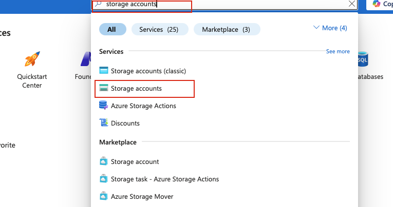
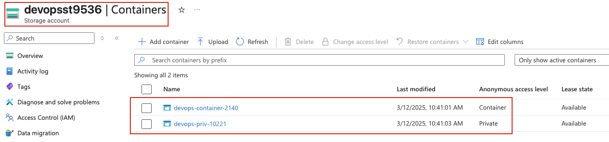
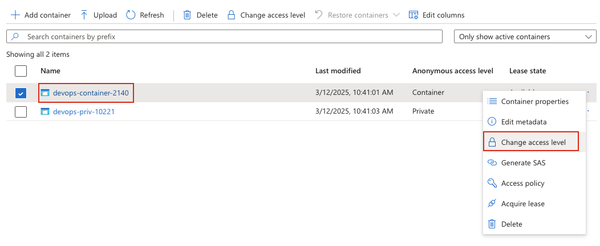
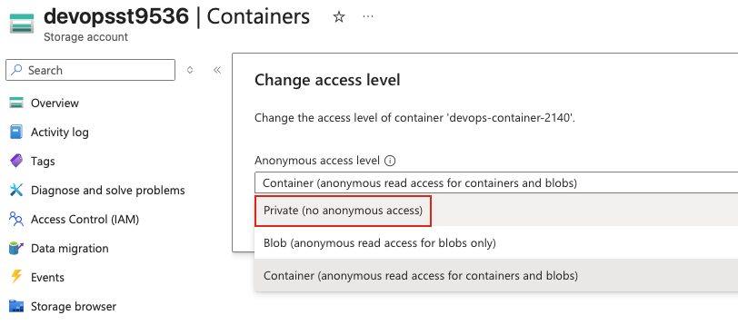
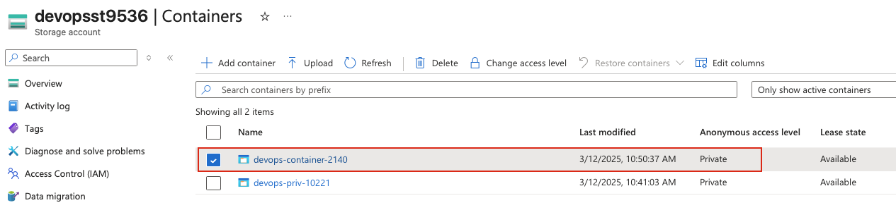

## Task: Convert Public Azure Blob Container to Private
The Nautilus DevOps team has been using Azure Blob Storage to manage their data. Recently, they realized that one of their containers, currently public, needs to be restricted for internal use only. Your task is to convert a public Azure Blob container to private.

Two blob containers named `devops-container-2140` and `devops-priv-10221` are available in the `East US` region within the storage account `devopsst9536`. The `devops-container-2140` is currently public, and `devops-priv-10221` is private.

1. Convert the blob container `devops-container-2140` from public to private while leaving `devops-priv-10221` unchanged.
2. Make sure the access level for `devops-container-2140` is set to `private` with no public access.

---

## Solution

### **Step 1: Log in to Azure Portal**
Go to the Azure Portal:  
https://portal.azure.com  
Sign in with the credentials provided.

### **Step 2: Navigate to Storage Accounts**
- In the top search bar, type **Storage accounts**.  
- Select **Storage accounts** from the list.  

### **Step 3: Select the Storage Account**
- From the list of storage accounts, locate and click on **devopsst9536**.  

### **Step 4: Navigate to Containers**
- In the left-hand menu under **Data storage**, click on **Containers**.  

### **Step 5: View Current Container Access Levels**
You should see both containers listed:
- **devops-container-2140** - Public access level (Container)
- **devops-priv-10221** - Private (no anonymous access)  

### **Step 6: Select the Public Container**
- Click on the three dots (**...**) or right-click on **devops-container-2140**.
- Select **Change access level** from the context menu.  

### **Step 7: Change Access Level to Private**
In the **Change access level** panel:

- **Anonymous access level:** Select **Private (no anonymous access)** from the dropdown  
- Click **OK** to apply the change.  

The access level will be changed immediately.

### **Step 8: Verify the Access Level Change**
Once the change is complete:

- Return to the **Containers** page
- Verify that **devops-container-2140** now shows **Private** in the **Public access level** column
- Verify that **devops-priv-10221** remains **Private** (unchanged)  

