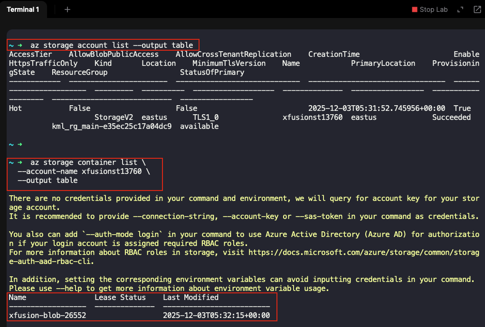
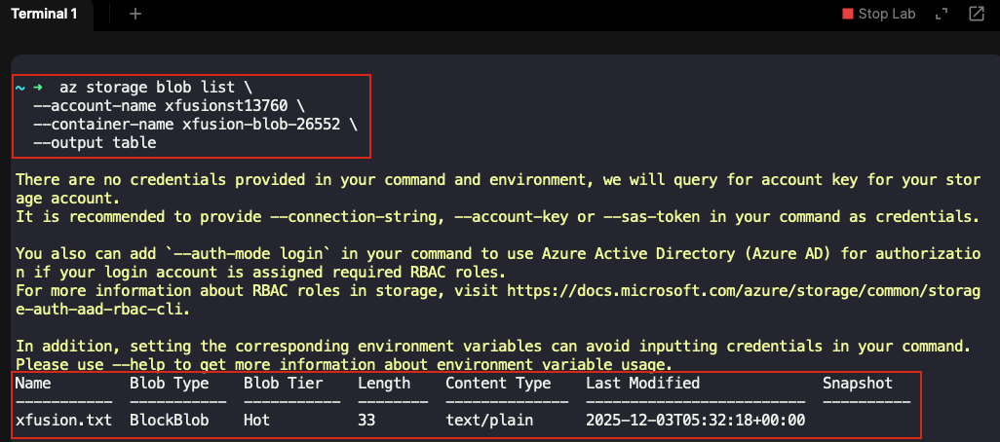
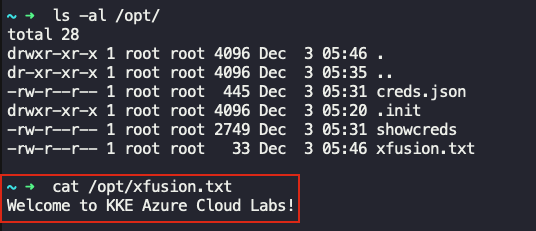
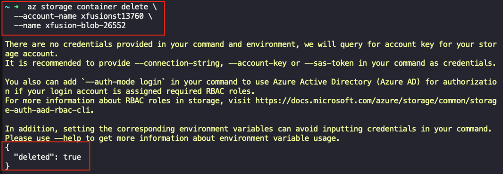

## Task: Backup and Delete Azure Storage Blob Container
The Nautilus DevOps team is currently engaged in a cleanup process, focusing on removing unnecessary data and services from their Azure environment. As part of the migration process, several resources were created for one-time use only, necessitating a cleanup effort to optimize their Azure environment.

A private blob container named `xfusion-blob-26552` already exists in the `East US` region under storage account `xfusionst13760`.

1. Copy the contents of `xfusion-blob-26552` blob container to the `/opt` directory on the `azure-client` host (the landing host once you load this lab).
2. Delete the blob container `xfusion-blob-26552` from the storage account.

---

## Solution

### **Step 1: Verify Storage Account and Container Exist**
On `azure-client` host's terminal run the following commands to verify:
```bash
# List all storage accounts to verify
az storage account list --output table

# List containers in the storage account
az storage container list \
  --account-name xfusionst13760 \
  --output table
```


### **Step 2: List Blobs in the Container**
Check what files exist in the container before downloading:
```bash
# List all blobs in the container
az storage blob list \
  --account-name xfusionst13760 \
  --container-name xfusion-blob-26552 \
  --output table
```


### **Step 3: Create Target Directory (if needed)**
Ensure the `/opt` directory exists and you have write permissions:

```bash
# Check if /opt exists
ls -la /opt
```

### **Step 4: Download All Blobs from Container**
Download all blobs from the container to the `/opt` directory:

```bash
# Download all blobs to /opt directory
az storage blob download-batch \
  --account-name xfusionst13760 \
  --source xfusion-blob-26552 \
  --destination /opt
```


### **Step 5: Verify Downloaded Files**

```bash
# List files in /opt directory
ls -al /opt/

# Check contents of downloaded file
cat /opt/xfusion.txt
```


### **Step 6: Delete the Blob Container via Azure CLI**

```bash
# Delete the blob container
az storage container delete \
  --account-name xfusionst13760 \
  --name xfusion-blob-26552
```


### **Step 7: Verify Container Deletion**

```bash
# List all containers to verify deletion
az storage container list \
  --account-name xfusionst13760 \
  --output table
```

**Expected Output:**
The `xfusion-blob-26552` container should no longer appear in the list.
