## Task: Assigning Public IP to Virtual Machines
The Nautilus DevOps Team has received a new request from the Development Team to set up a new Azure Virtual Machine (VM). This VM will be used to host a new application that requires a stable public IP address. To ensure that the VM has a consistent public IP, a Static Public IP address needs to be associated with it. The VM will be named `xfusion-vm`, and the Static Public IP will be named `xfusion-pip`. This setup will help the Development Team to have a reliable and consistent access point for their application.

1. Create an Azure VM named `xfusion-vm` using any available Ubuntu image, with the VM size `Standard_B1s`.
2. Generate an SSH public key on the `azure-client` host and associate it with the VM for SSH access.
3. Associate a Static Public IP address named `xfusion-pip` with this VM.
4. Ensure the VM is accessible via SSH using the generated public key.

---

## Solution

### **Step 1: Verify You're on the Azure Client Host**
```bash
# Check hostname
hostname
# Check current user
whoami
```
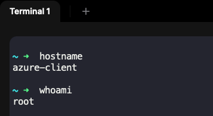

### **Step 2: Generate SSH Key Pair**
```bash
ssh-keygen
```
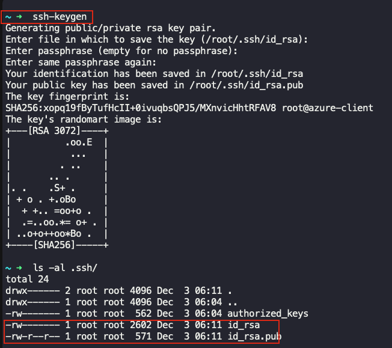

**During key generation:**
- Press **Enter** when prompted for passphrase (or set one for added security)
- Press **Enter** again to confirm
- We are creating a ssh key-pair using default values

### **Step 3: View the Public Key**
```bash
# Display the public key
cat ~/.ssh/id_rsa.pub
```
Keep this key handy - you'll need it for VM creation.

### **Step 4: Log in to Azure Portal**
Go to the Azure Portal:  
https://portal.azure.com  
Sign in with the credentials provided.

### **Step 5: Search for Public IP Addresses**
- In the top search bar, type **Public IP addresses**.  
- Select **Public IP addresses** from the list.  
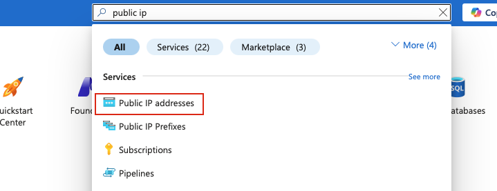

### **Step 6: Create a New Public IP Address**
- Click **Create**

### **Step 7: Configure Static Public IP**
Provide the following values:

- **Resource Group:** Select an existing resource group
- **Name:** `xfusion-pip`  
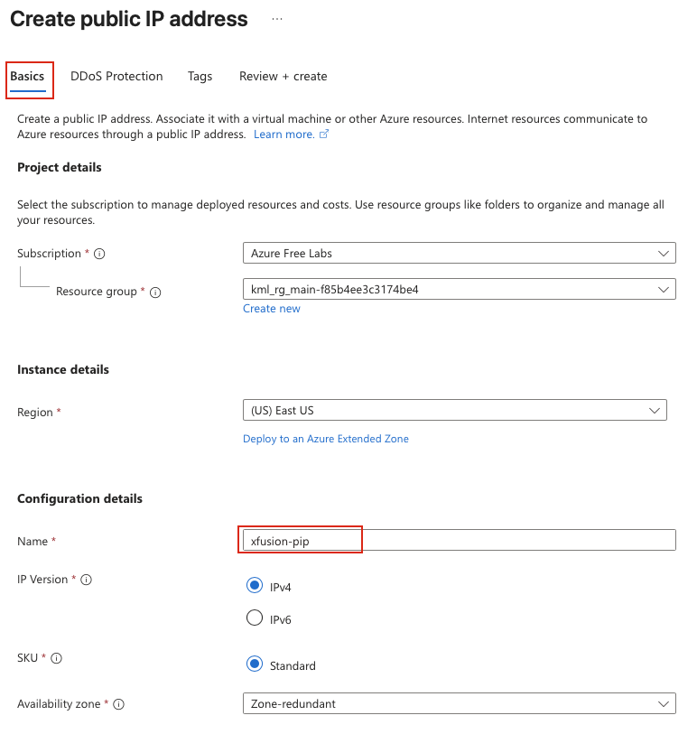

Leave other options as default.

### **Step 8: Review and Create Public IP**
- Click **Review + create**  
- Verify all settings  
- Click **Create**  
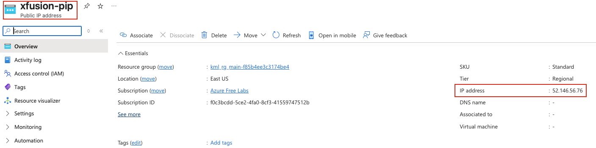

Wait for the deployment to complete. Note the **IP address** that was allocated - you'll need this later.

### **Step 9: Navigate to Virtual Machines**
- In the Azure Portal, search for **Virtual Machines**  
- Click **Create** → **Azure virtual machine**  

### **Step 10: Configure Basic Settings**

**Basics Tab:**

- **Resource Group:** Select the same resource group used for the public IP  
- **Virtual machine name:** `xfusion-vm`  
- **Region:** Select the **same region** as the public IP (e.g., `East US`)
- **Availability options:** Select `No infrastructure redundancy required`  
- **Image:** Select any available **Ubuntu** image  
- **Size:** Click **See all sizes** and select **Standard_B1s**  
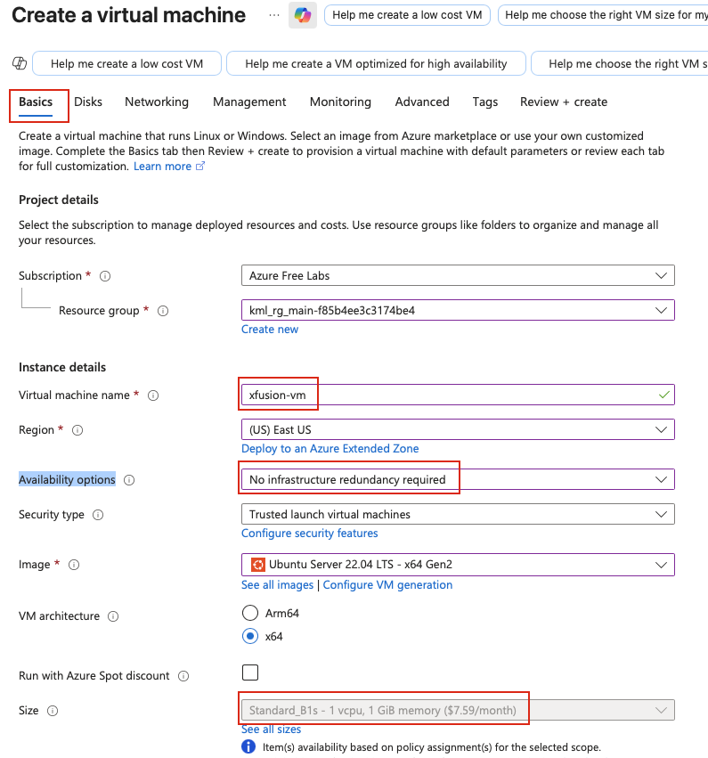

**Administrator Account:**

- **Authentication type:** `SSH public key`  
- **Username:** `azureuser`  
- **SSH public key source:** `Use existing public key`  
- **SSH public key:** Paste the content from `~/.ssh/id_rsa.pub`  
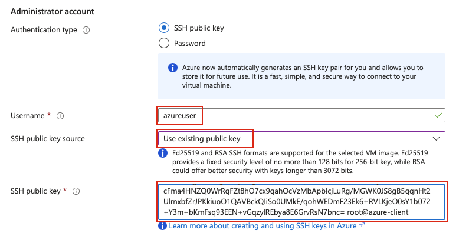

To copy the key from your terminal:
```bash
cat ~/.ssh/id_rsa.pub
```

**Inbound Port Rules:**

- **Public inbound ports:** `Allow selected ports`  
- **Select inbound ports:** Check **SSH (22)**  
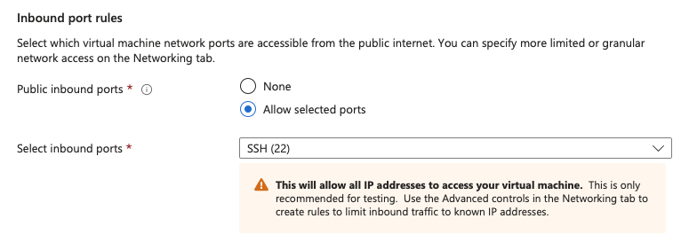

Click **Next: Disks** to proceed.

### **Step 11: Configure Disks (Optional)**

**Disks Tab:**

- **OS disk size:** Default (or adjust as needed)  
- **OS disk type:** `Standard HDD`  
- **Delete with VM:** Checked (recommended for cleanup)  
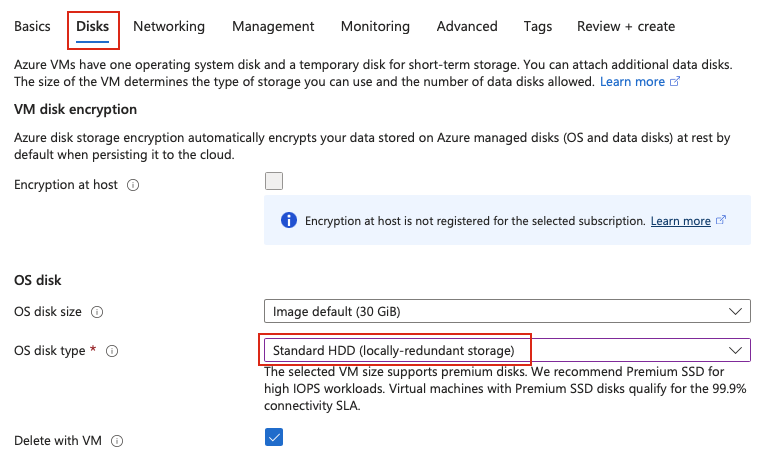

Keep default settings or adjust as needed. Click **Next: Networking**.

### **Step 12: Configure Networking with Static IP**

**Networking Tab:**

- **Virtual network:** Select existing or create new  
- **Subnet:** Default or select specific subnet  
- **Public IP:** Click the dropdown and select **xfusion-pip** (the static IP we created earlier)  
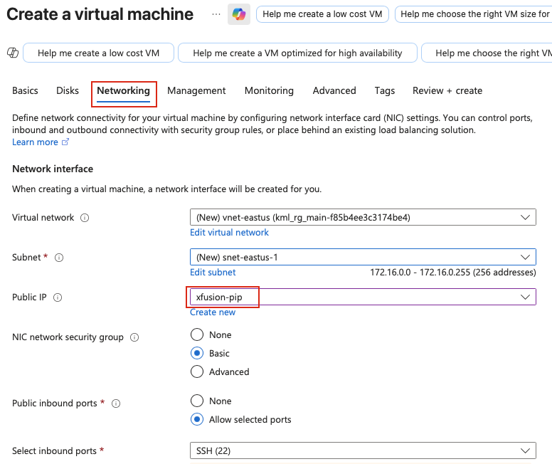

**IMPORTANT:** Make sure you select the **xfusion-pip** public IP address we created earlier.

### **Step 13: Review and Create VM**

- Review all configuration settings:
  - VM name: **xfusion-vm**
  - Size: **Standard_B1s**
  - Public IP: **xfusion-pip (Static)**
  - SSH authentication configured
- Click **Review + create**  
- Wait for validation  
- Click **Create**  

Azure will now provision the Virtual Machine. This may take 3-5 minutes.

### **Step 14: Wait for Deployment**

Monitor the deployment progress. Once complete, click **Go to resource** to view the VM details.  
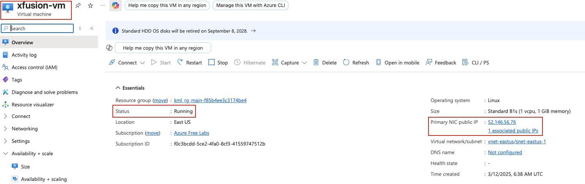

### **Step 15: Get the Static Public IP Address**

From the VM overview page:
- Note the **Public IP address** (should be the same as xfusion-pip)
- Verify it matches the IP allocated to xfusion-pip

### **Step 16: Test SSH Connection**

From the azure-client host, connect to the VM using SSH:
```bash
# SSH into the VM using the private key
ssh azureuser@<PUBLIC_IP_ADDRESS>
```


Replace `<PUBLIC_IP_ADDRESS>` with the actual IP address and `azureuser` with your configured username.
