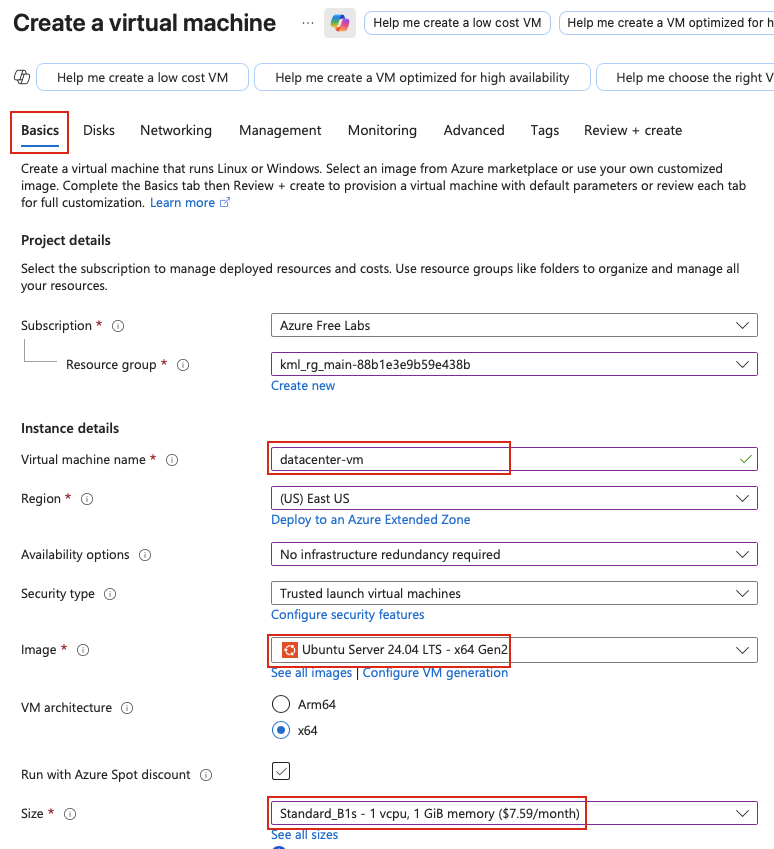
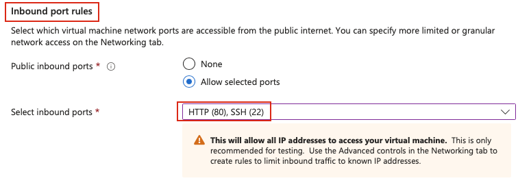
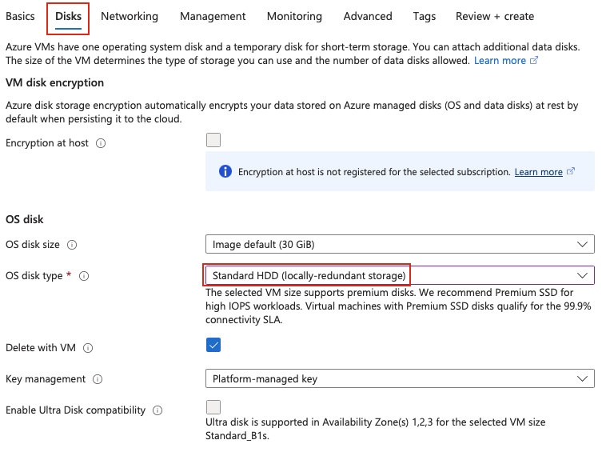
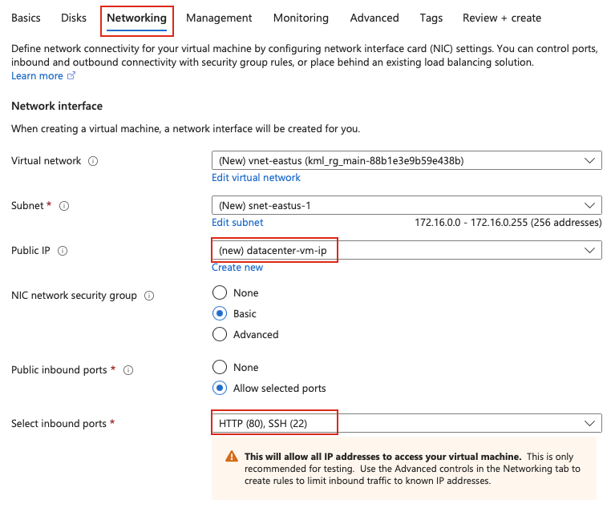
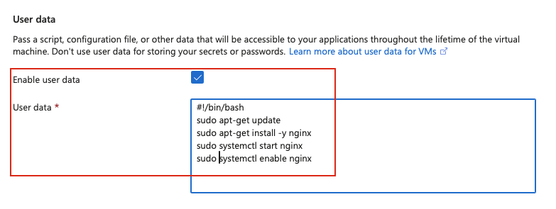
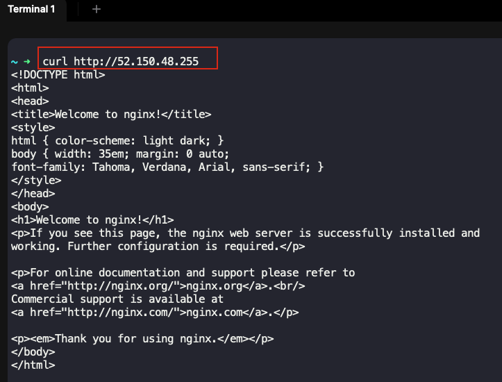

## Task: Configuring Instances with User Data
The Nautilus DevOps Team is working on setting up a new virtual machine (VM) to host a web server for a critical application. The team lead has requested you to create an Azure VM that will serve as a web server using Nginx. This VM will be part of the initial infrastructure setup for the Nautilus project. Ensuring that the server is correctly configured and accessible from the internet is crucial for the upcoming deployment phase.

As a member of the Nautilus DevOps Team, your task is to create a VM with the following specifications:

1. **Instance Name:** The VM must be named `datacenter-vm`.
2. **Image:** Use any available Ubuntu image to create this VM.
3. **Custom Script Extension/User Data:** Configure the VM to run a custom script during its launch. This script should:
   - Install the `Nginx` package.
   - Start the `Nginx` service.
4. **Network Security Group (NSG):** Ensure that the VM allows HTTP traffic on port `80` from the internet.

---

## Solution

### **Step 1: Prepare user data script**

Before creating the VM, prepare the user-data script that will install and configure Nginx.

```bash
#!/bin/bash
sudo apt-get update
sudo apt-get install -y nginx
sudo systemctl start nginx
sudo systemctl enable nginx
```

### **Step 2: Log in to Azure Portal**
Go to the Azure Portal:  
https://portal.azure.com  
Sign in with the credentials provided.

### **Step 3: Navigate to Virtual Machines**
- In the top search bar, type **Virtual Machines**.  
- Select **Virtual Machines** from the list.  
- Click **Create** → **Azure virtual machine**  

### **Step 4: Configure Basic Settings**

**Basics Tab:**

- **Resource Group:** Select an existing resource group  
- **Virtual machine name:** `datacenter-vm`  
- **Region:** `East US`
- **Availability options:** No infrastructure redundancy required  
- **Image:** Select any available **Ubuntu** image  
- **Size:** Select `Standard_B1s`  


**Administrator Account:**

- **Authentication type:** `SSH public key`  
- **Username:** Enter a username (e.g., `azureuser`)  
- **SSH public key source:** `Generate new key pair` 
- **Key pair name:** `datacenter-vm-key` (if generating new)  

**Inbound Port Rules:**

- **Public inbound ports:** `Allow selected ports`  
- **Select inbound ports:** Check both **SSH (22)** and **HTTP (80)**  


**IMPORTANT:** Make sure to select **both SSH (22) and HTTP (80)** to allow web traffic.

Click **Next: Disks** to proceed.

### **Step 5: Configure Disks**

**Disks Tab:**

- **OS disk size:** Default  
- **OS disk type:** `Standard HDD`
- **Delete with VM:** Checked  


### **Step 6: Configure Networking**

**Networking Tab:**

- **Virtual network:** Select existing or create new  
- **Subnet:** Default  
- **Public IP:** Create new  
- **NIC network security group:** `Basic`  
- **Public inbound ports:** `Allow selected ports`  
- **Select inbound ports:** Verify **SSH (22)** and **HTTP (80)** are selected  


Proceed to **Advanced**.

### **Step 7: Configure Advanced Settings with User Data**

**Advanced Tab:**

In User Data section

- **Enable user data:** Check the box to Enable it  
- **User data:** Paste the cloud-init script content:

```bash
#!/bin/bash
sudo apt-get update
sudo apt-get install -y ngin
sudo systemctl start nginx
sudo systemctl enable nginx
```


### **Step 8: Review and Create**

- Review all configuration settings:
  - VM name: **datacenter-vm**
  - Image: **Ubuntu Server**
  - Ports open: **SSH (22) and HTTP (80)**
  - User data: **User Data configured**
- Click **Review + create**  
- Wait for validation  
- Click **Create**  

### **Step 9: Wait for Deployment**

The VM creation will take 3-5 minutes. Azure will:
- Provision the VM
- Apply the user-data script
- Install and start Nginx

Monitor the deployment progress. Once complete, click **Go to resource**.

### **Step 10: Get Public IP Address**

From the VM overview page:
- Note the **Public IP address**
- This is the IP you'll use to access the web server  


### **Step 11: Test Web Server from Internet**
On the `azure-client` host's terminal:
```bash
curl http://<PUBLIC_IP>
```


You should see the default Nginx welcome page since we haven't made any changes.
