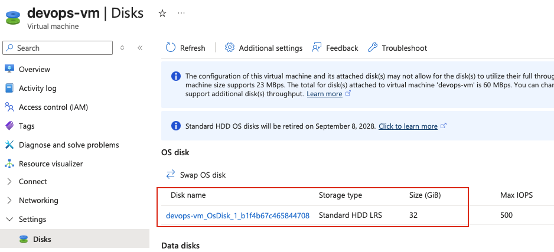
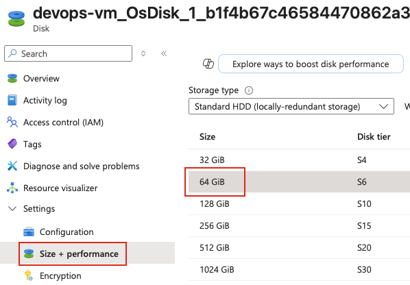
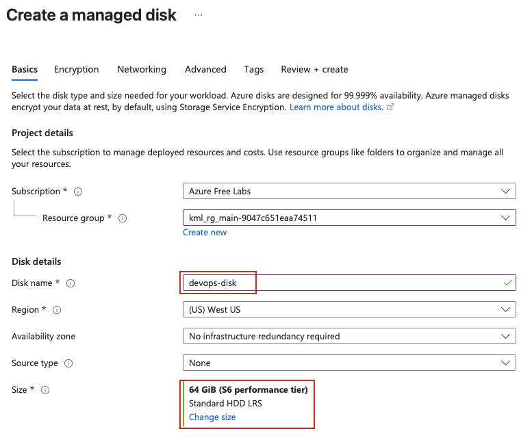
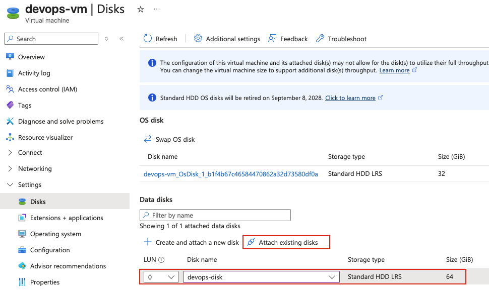
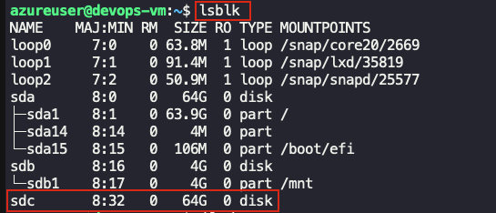
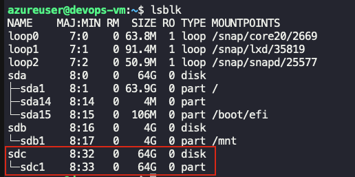

## Task: Expanding and Managing Disk Storage
The Nautilus DevOps team needs to expand the storage capacity of an existing virtual machine and add an additional data disk to support increased workloads. This task requires resizing the existing VM disk and mounting a new data disk to the VM.

1. Expand the existing VM `devops-vm` disk from `32Gi` to `64Gi`.
2. Create a new standard HDD data disk named `devops-disk` of `64Gi` and mount the disk to VM `devops-vm` at location `/mnt/devops-disk`.

---

## Solution

### **Step 1: Log in to Azure Portal**
Go to the Azure Portal:  
https://portal.azure.com  
Sign in with the credentials provided.

### **Step 2: Navigate to Virtual Machines**
- In the top search bar, type **Virtual Machines**.  
- Select **Virtual Machines** from the list.  
- Click on **devops-vm**  

### **Step 3: Stop (Deallocate) the VM**
**IMPORTANT:** The VM must be stopped (deallocated) to resize the OS disk.
- From the VM overview page, click **Stop** at the top  
- Wait for the VM to stop completely  
- Verify the status shows **Stopped (deallocated)**  

### **Step 4: Navigate to Disks**
- In the left-hand menu under **Settings**, click on **Disks**  
- You should see the OS disk listed (typically named like `devops-vm_OsDisk_...`)  
- Note the current size (32 GiB)  


### **Step 5: Click on the OS Disk**
- Click on the **OS disk name** to open the disk properties  

### **Step 6: Resize the Disk**
- In the left-hand menu, click on **Size + performance**  
- You'll see the current disk size (32 GiB)  
- Change the disk size from **32 GiB** to **64 GiB** and click **Save**  


### **Step 7: Start the VM**
- Go back to the VM overview page  
- Click **Start** at the top  
- Wait for the VM to start  
- Copy the public IP from the **Overview** tab

### **Step 8: SSH into the VM**
From `azure-client` host's terminal:
```bash
ssh azureuser@<PUBLIC_IP>
```

### **Step 9: Create a New Managed Disk**
- Go to **Disks** from the Azure Portal search
- Click **+ Create**
- Configure the disk:
   - **Resource Group:** Same as devops-vm
   - **Disk name:** `devops-disk`
   - **Region:** Same region as devops-vm
   - **Size:** Click **Change size**
     - Select **Standard HDD (locally-redundant storage)**
     - Set size to **64 GiB**
   - Click **Review + create**
   - Click **Create**



### **Step 10: Attach the Disk to the VM**
- Go to **Virtual Machines** → **devops-vm**
- Click on **Disks** in the left menu
- Click **+ Attach existing disks**
- In the **Name** dropdown, select **devops-disk**
- Click **Apply**



### **Step 11: SSH into VM and Identify the New Disk**

```bash
# SSH into the VM (if not already connected)
ssh azureuser@<PUBLIC_IP>

# List all block devices
lsblk
```


The new disk will typically be `/dev/sdc` (or the next available letter).

**Check if the disk has any partitions:**
```bash
sudo fdisk -l /dev/sdc
```

### **Step 12: Create Partition on the New Disk**

```bash
# Create a partition on the new disk
sudo fdisk /dev/sdc
```

**Interactive fdisk commands:**
- Type `n` and press Enter (new partition)
- Press Enter (primary partition - default)
- Press Enter (partition number 1 - default)
- Press Enter (first sector - default)
- Press Enter (last sector - default, uses entire disk)
- Type `w` and press Enter (write changes)

**Verify the partition was created:**
```bash
lsblk
```



### **Step 13: Format the Partition**
```bash
# Format the partition with ext4 filesystem
sudo mkfs.ext4 /dev/sdc1
```

### **Step 14: Create Mount Point**
```bash
# Create the mount point directory
sudo mkdir -p /mnt/devops-disk

# Verify it was created
ls -la /mnt/
```

### **Step 15: Mount the Disk**
```bash
# Mount the disk
sudo mount /dev/sdc1 /mnt/devops-disk

# Verify it's mounted
df -h /mnt/devops-disk
```
This should satisfy the task requirements, further steps are optional.

### **Step 16: Configure Auto-Mount on Boot(Optional)**
To ensure the disk mounts automatically after reboot, add it to `/etc/fstab`.

**Get the UUID of the partition:**
```bash
sudo blkid /dev/sdc1
```

**Sample Output:**
```
/dev/sdc1: UUID="12345678-1234-1234-1234-123456789abc" TYPE="ext4" PARTUUID="87654321-4321-4321-4321-210987654321"
```

**Copy the UUID value.**

**Add entry to /etc/fstab:**
```bash
# Backup fstab first
sudo cp /etc/fstab /etc/fstab.backup

# Add the entry (replace UUID with your actual UUID)
echo 'UUID=12345678-1234-1234-1234-123456789abc /mnt/devops-disk ext4 defaults,nofail 0 2' | sudo tee -a /etc/fstab
```

**Verify the fstab entry:**
```bash
cat /etc/fstab
```

**Test the fstab configuration:**
```bash
# Unmount the disk
sudo umount /mnt/devops-disk

# Test mount all filesystems from fstab
sudo mount -a

# Verify it mounted correctly
df -h /mnt/devops-disk
```
