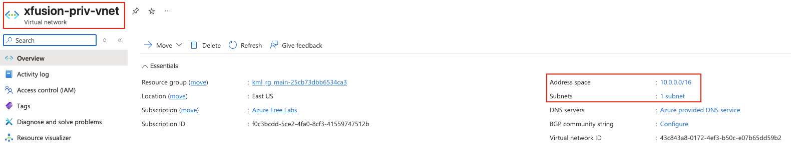
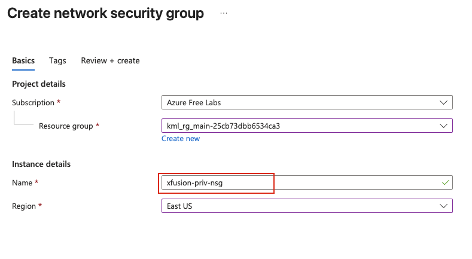

## Task: Deploying Virtual Machines in a Private Virtual Network
The Nautilus DevOps team is expanding their Azure infrastructure and requires the setup of a private Virtual Network (VNet) along with a subnet. This VNet and subnet configuration will ensure that resources deployed within them remain isolated from external networks and can only communicate within the VNet. Additionally, the team needs to provision a Virtual Machine (VM) under the newly created private VNet.

1. Create a private VNet named `xfusion-priv-vnet`.
2. Create a subnet named `xfusion-priv-subnet` under the VNet.
3. Create a Virtual Machine named `xfusion-priv-vm` under this VNet.
4. Create a Network Security Group (NSG) named `xfusion-priv-nsg`.
5. Ensure that the NSG rules for the VM allow SSH access only from within the VNet's CIDR block.
6. Ensure all resources are created in the `East US` region.

---

## Solution

### Part 1: Create Private Virtual Network

#### **Step 1: Log in to Azure Portal**
Go to the Azure Portal:  
https://portal.azure.com  
Sign in with the credentials provided.

#### **Step 2: Search for Virtual Networks**
- In the top search bar, type **Virtual networks**.  
- Select **Virtual networks** from the list.  

#### **Step 3: Create a New Virtual Network**
- Click **+ Create**

#### **Step 4: Configure Basic Settings**
**Basics Tab:**

- **Resource Group:** Select existing resource group  
- **Virtual network name:** `xfusion-priv-vnet`  
- **Region:** `(US) East US`   

#### **Step 5: Configure IP Address Space**
**IP Addresses Tab:**

- **IPv4 address space:** Use a private IP range (e.g., `10.0.0.0/16` or `172.16.0.0/16`)
  - We'll use `10.0.0.0/16` for this example

#### **Step 6: Add Private Subnet**
- Click **+ Add subnet**
- Configure the subnet:

**Subnet Configuration:**
- **Subnet name:** `xfusion-priv-subnet`
- **Subnet address range:** `10.0.1.0/24` (within the VNet address space)
- **Network security group:** None (we'll create and associate a custom NSG later)

#### **Step 7: Review and Create VNet**
- Click **Review + create**
- Verify all settings:
  - VNet name: `xfusion-priv-vnet`
  - Region: `East US`
  - Subnet name: `xfusion-priv-subnet`
  - Address space: `10.0.0.0/16`
  - Subnet range: `10.0.1.0/24`
- Click **Create**

#### **Step 8: Verify VNet Creation**
- Click **Go to resource** or navigate to **Virtual networks**
- Select **xfusion-priv-vnet**
- Verify the VNet details in the Overview page
- Click on **Subnets** to verify `xfusion-priv-subnet` was created

#### **Step 9: Search for Network Security Groups**
- In the top search bar, type **Network security groups**
- Select **Network security groups** from the list

#### **Step 10: Create New NSG**
- Click **+ Create**

#### **Step 11: Configure NSG Basic Settings**
**Basics Tab:**

- **Resource Group:** Same resource group as the VNet
- **Name:** `xfusion-priv-nsg`
- **Region:** `(US) East US` 

Click **Review + create** → **Create**

#### **Step 12: Configure NSG Inbound Rules**
Once the NSG is created:
- Click **Go to resource** or navigate to the NSG
- In the left menu, click on **Inbound security rules**

#### **Step 13: Add SSH Rule for VNet Only**
**IMPORTANT:** We need to allow SSH only from within the VNet's CIDR block (10.0.0.0/16).  
Click **+ Add** to create a new inbound rule

**Configure the SSH rule:**

- **Source:** `IP Addresses`
- **Source IP addresses/CIDR ranges:** `10.0.0.0/16` 
- **Source port ranges:** `*`
- **Destination:** `10.0.0.0/16`
- **Service:** `SSH`
- **Destination port ranges:** `22` 
- **Protocol:** `Any`
- **Action:** `Allow`
- **Priority:** `100` (or any value between 100-4096)
- **Name:** `AllowSSHFromVNet`
- **Description:** `Allow SSH traffic access only from within the VNet`

Click **Add** to create the rule.

#### **Step 14: Associate NSG with subnet**
After adding the inbound rule, associate the nsg with the subnet that we've created earlier.
- On the NSG page, go to **Settings** → **Subnets**
- Click **+ Associate** and select **xfusion-priv-subnet**

#### **Step 15: Navigate to Virtual Machines**
- In the top search bar, type **Virtual Machines**
- Select **Virtual Machines** from the list
- Click **+ Create** → **Azure virtual machine**

#### **Step 16: Configure VM Basic Settings**
**Basics Tab:**

- **Resource Group:** Same resource group as VNet and NSG
- **Virtual machine name:** `xfusion-priv-vm`
- **Region:** `(US) East US`
- **Availability options:** No infrastructure redundancy required
- **Image:** Selcet any available **Ubuntu** image
- **Size:** `Standard_B1s`

**Inbound Port Rules:**

- **Public inbound ports:** `None` 
  - We'll control access through the NSG we created

#### **Step 17: Configure Disks**
**Disks Tab:**

- **OS disk size:** Default
- **OS disk type:** `Standard HDD`
- **Delete with VM:** Checked

#### **Step 18: Configure Networking (CRITICAL STEP)**
**Networking Tab:**

This is where we connect the VM to our private VNet and attach the custom NSG.

- **Virtual network:** Select **xfusion-priv-vnet** 
- **Subnet:** Select **xfusion-priv-subnet** 
- **Public IP:** **None** 
- **NIC network security group:** `Advanced`
- **Configure network security group:** Select **xfusion-priv-nsg** 

#### **Step 19: Review and Create VM**
- Review all configuration settings:
  - VM name: **xfusion-priv-vm**
  - Region: **East US**
  - VNet: **xfusion-priv-vnet**
  - Subnet: **xfusion-priv-subnet**
  - Public IP: **None** (Private VM)
  - NSG: **xfusion-priv-nsg**
- Click **Review + create**
- Wait for validation
- Click **Create**

#### **Step 20: Wait for VM Deployment**
The VM creation will take 3-5 minutes. Wait for deployment to complete.  
