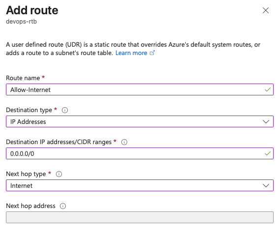
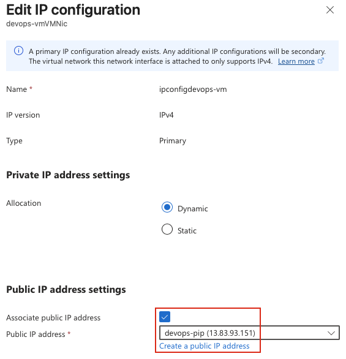
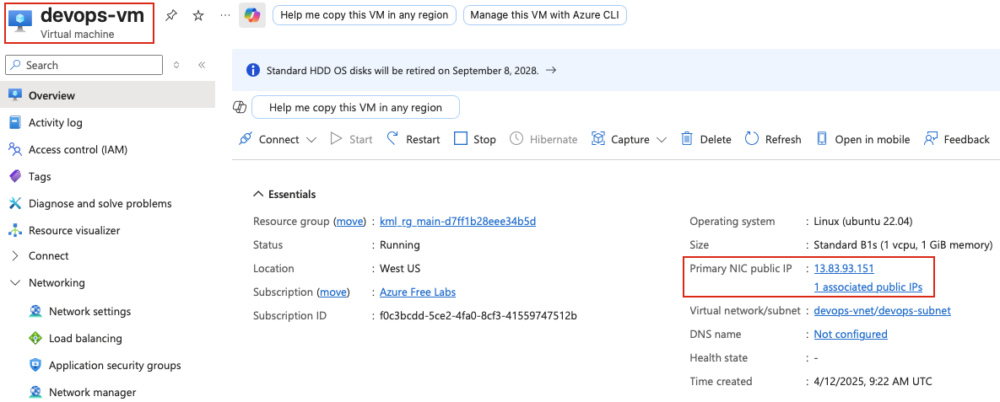
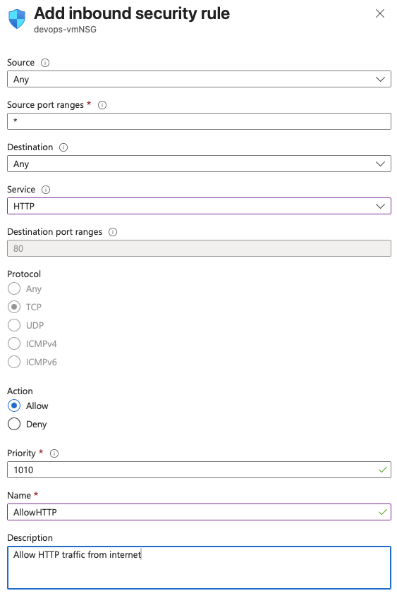

## Task: Troubleshooting Public Virtual Network Configurations
The Nautilus DevOps Team deployed an Nginx server on an Azure VM in a public VNet named `devops-vnet`. However, the server is still inaccessible from the internet.

As a DevOps team member, complete the following tasks:

1. **Verify VNet Configuration**: Ensure `devops-vnet` allows internet access.
2. **Attach Public IP**: A public IP named `devops-pip` already exists. Attach this public IP to the VM `devops-vm` to make it accessible from the internet.
3. **Ensure Accessibility**: Confirm the VM `devops-vm` is accessible on port `80`.
Use the provided Azure credentials to troubleshoot and resolve the issue.

--- 

## Solution

### **Step 1: Log in to Azure Portal**
Go to the Azure Portal:  
https://portal.azure.com  
Sign in with the credentials provided.

### **Step 2: Verify VNet Configuration**
- Go to Azure Portal → Virtual networks → devops-vnet.
- Select Subnets → choose the subnet where devops-vm resides.
- Ensure:
  - Route Table is Not Associated, OR
  - Associated route table does not contain:
    - 0.0.0.0/0 → Next hop: None
    - 0.0.0.0/0 → Next hop: Virtual appliance (unless intentional)  


### **Step 3: Attach Public IP to the VM**
Refer [Day10](Day10.md) to check how to attach public IP.  


### **Step 4: Verify Public IP Assignment**
Once the operation completes:

- Go back to **Virtual Machines** → **devops-vm**  
- On the **Overview** page, check the **Public IP address** field  
- Verify that it now shows the IP address from **devops-pip**  


### **Step 5: Update Inbound rules to Allow HTTP traffic**
- Go to **Settings** → **Inbound security rules** of the NSG attached to the VM
- Add inbound rule to allow HTTP traffic  


### **Step 6: Verify setup**
- SSH to the VM from the `azure-client` host's terminal:
```bash
ssh azureuser@<Public_IP>
```

- Install and start `nginx` service on `devops-vm`:
```bash
sudo apt update -y
sudo apt install nginx -y
sudo systemctl start nginx
sudo systemctl enable nginx
```

- Test the web server accessibility from your `azure-client` host's terminal:
```bash
curl http://<PUBLIC_IP>
```