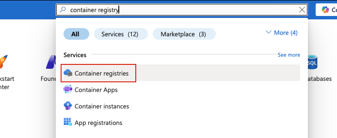
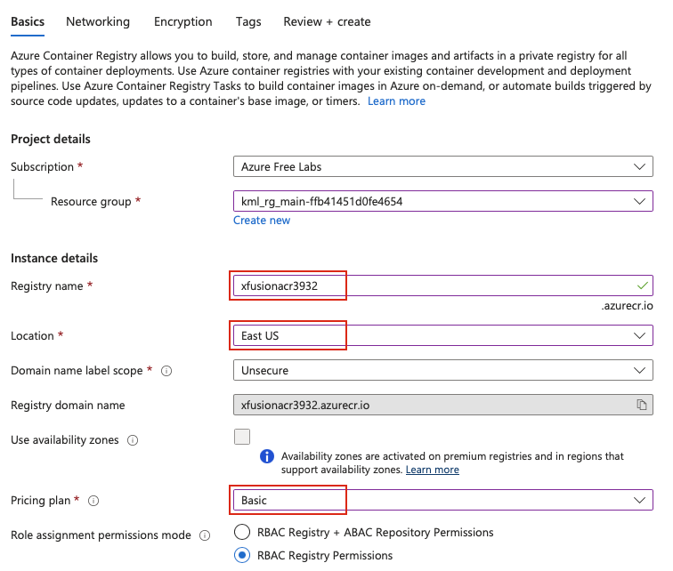
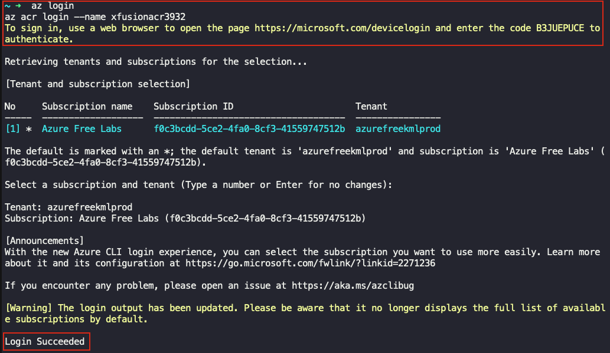
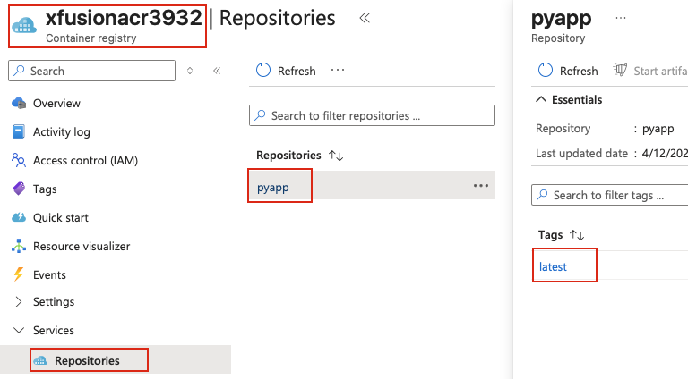

## Task: Working with Azure Container Registry (ACR)
The Nautilus DevOps team has been tasked with setting up a containerized application. They need to create an Azure Container Registry (ACR) to store their Docker images. Once the repository is created, they will build a Docker image from a Dockerfile located on the `azure-client` host and push this image to the ACR repository.

1. Create an ACR repository named `xfusionacr3932` under `East US`.
2. Pricing plan must be `Basic`.
3. Dockerfile already exists under `/root/pyapp` directory on `azure-client` host.
4. Build a Docker image using this Dockerfile and push the same to the newly created ACR repo. The image tag must be `latest` i.e `xfusionacr3932.azurecr.io/pyapp:latest`.

---

## Solution

### **Step 1: Log in to Azure Portal**
Go to the Azure Portal:  
https://portal.azure.com  
Sign in with the credentials provided.

### **Step 2: Search for Container Registries**
- In the top search bar, type **Container registries**.  
- Select **Container registries** from the list.  


### **Step 3: Create New Container Registry**
- Click **+ Create** 

### **Step 4: Configure Basic Settings**
**Basics Tab:**

- **Resource Group:** Select existing resource group 
- **Registry name:** `xfusionacr3932` 
- **Location:** `(US) East US` 
- **Pricing plan:** `Basic`  


Leave other options as default.

### **Step 5: Review and Create ACR**
- Review all settings:
  - Registry name: `xfusionacr3932`
  - Location: `East US`
  - Pricing plan: `Basic`
- Click **Create**

Wait for deployment to complete (1-2 minutes).

### **Step 6: Verify ACR Creation**
Once deployment completes:
- Click **Go to resource**
- Note the **Login server**: `xfusionacr3932.azurecr.io`
- This is the registry URL you'll use to push images

### **Step 7: Login in to your registry**
From the `azure-client` host's terminal:
```bash
# To authenticate your Azure CLI session if not done already
az login
# Login to the container registry using your existing Azure CLI login
az acr login --name xfusionacr3932
```
Follow the authentication steps to complete login.  


### **Step 8: Navigate to Dockerfile Directory**
```bash
cd /root/pyapp

# Verify you're in the correct directory
pwd
ls -la
```

### **Step 9: Build Docker Image**
Build the Docker image with the ACR repository URL and tag:
```bash
# Build the Docker image
docker build -t xfusionacr3932.azurecr.io/pyapp:latest .
```

### **Step 10: Verify Image Built Successfully**
```bash
# List Docker images
docker images | grep xfusionacr3932
```

### **Step 11: Push Image to ACR**
```bash
# Push the image to ACR
docker push xfusionacr3932.azurecr.io/pyapp:latest
```

### **Step 12: Check ACR Repositories**
1. Go to **Container registries** → **xfusionacr3932**
2. In the left menu, click **Services** → **Repositories**
3. You should see **pyapp** listed
4. Click on **pyapp**
5. Verify the **latest** tag is present


