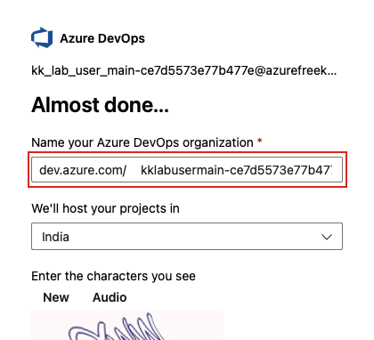
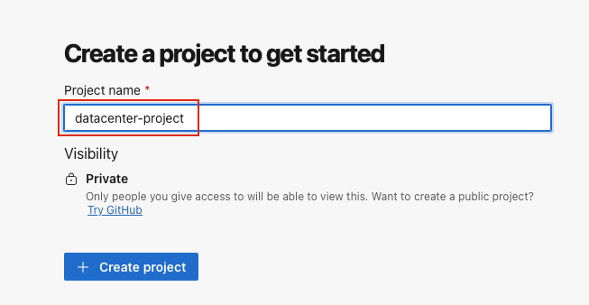
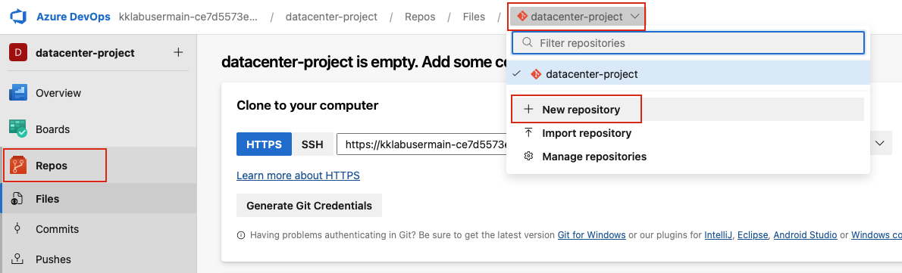
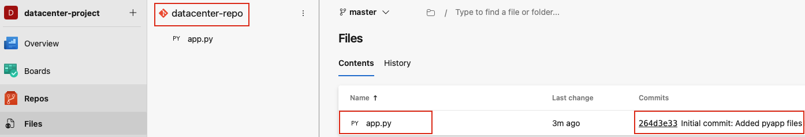

## Task: Set Up and Manage a Secure Azure DevOps Repository
The Nautilus DevOps Team has received a request from the Development Team to set up a new repository for better code management. They need a secure way to access the repository using SSH.

1. Create an organization with the name it picks up by default (`do not use any custom name`), create a project named `datacenter-project` under it and an Azure DevOps repository named `datacenter-repo` under the same.
2. Add the `root` user's SSH public key from `azure-client` host to the Azure DevOps SSH keys.
3. Create an SSH config under `/root/.ssh/config` on `azure-client` host and make changes to authenticate with the created repository.
4. Clone the new repository on `azure-client` host under `/root`.
5. Add the contents of `/root/pyapp` directory to this repository, then add, commit, and push the changes to the repository. You might need to set the git user and email to commit your code; you can use any email ID and user name for that.

---

## Solution

### **Step 1: Log in to Azure DevOps Portal**
Go to the Azure DevOps Portal:  
https://dev.azure.com  
Sign in with the same credentials used for Azure Portal.

### **Step 2: Create Organization**
- If this is your first time logging in, Azure DevOps will automatically prompt you to create an organization
- **Accept the default organization name** that Azure suggests (usually based on your email)
- **Do not use a custom name**
- Click **Continue**  


### **Step 3: Create New Project**
Once the organization is created:
- You'll see a "Create a project to get started" screen
- Click **+ Create project** or **+ New project**
- **Project name:** Enter `datacenter-project`
- Click **Create**  


### **Step 4: Create Azure DevOps Repository**
After the project is created:
- You'll be automatically taken to the project dashboard
- In the left sidebar, click **Repos**
- Click on the repository dropdown at the top (it shows "datacenter-project" by default)
- Click **+ New repository**  


**Repository Settings:**
- **Repository type:** `Git`
- **Repository name:** `datacenter-repo`
- **Add a README:** Leave unchecked  
- Click **Create**

### **Step 5: Add SSH Public Key to Azure DevOps**
Now add the SSH key to your Azure DevOps profile:
- Click on your **settings icon** (top right corner)
- Click **SSH public keys** → **+ New Key**  


**Add SSH Key:**
- **Name:** `azure-client-root-key` (or any descriptive name)
- **Public Key Data:** Paste the public key from `cat ~/.ssh/id_rsa.pub`
- Click **Add**

### **Step 6: Get Repository SSH URL**
- Go back to **Repos** → **Files**
- Click **Clone** button
- Select **SSH** tab
- Copy the SSH URL  

### **Step 7: Create SSH Config File**
On the `azure-client` host, create the SSH config file:
```bash
# Create SSH config file
cat > /root/.ssh/config << 'EOF'
Host ssh.dev.azure.com
  IdentityFile ~/.ssh/id_rsa
  IdentitiesOnly yes
  HostkeyAlgorithms +ssh-rsa
  PubkeyAcceptedKeyTypes +ssh-rsa
EOF

# Set proper permissions
chmod 600 /root/.ssh/config
chmod 700 /root/.ssh
chmod 600 /root/.ssh/id_rsa
```

### **Step 8: Test SSH Connection**
Test the SSH connection to Azure DevOps:
```bash
# Test SSH connection
ssh -T git@ssh.dev.azure.com
```

You should see a message like: `remote: Shell access is not supported.`  
This confirms SSH authentication is working.

### **Step 9: Configure Git User**
Set up Git user configuration:
```bash
# Set Git user name and email
git config --global user.name "Nautilus DevOps"
git config --global user.email "devops@nautilus.com"
```

### **Step 10: Clone Repository**
Clone the repository to `/root`:
```bash
# Navigate to /root directory
cd /root

# Clone the repository (replace with your actual SSH URL copied in step 6)
git clone <git_SSH_URL>
```

### **Step 11: Navigate to Cloned Repository**
```bash
# Navigate into the cloned repository
cd datacenter-repo

# Verify you're in the correct directory
pwd
ls -la
```

### **Step 12: Copy Files from /root/pyapp**
Copy the contents of `/root/pyapp` directory to the repository:
```bash
# Copy all files from /root/pyapp to current directory
cp -r /root/pyapp/* .

# Verify files are copied
ls -la
```

### **Step 13: Add, Commit, and Push Changes**
Add, commit, and push the files to the repository:
```bash
# Add all files to staging
git add .

# Commit changes
git commit -m "Initial commit: Added pyapp files"

# Push changes to remote repository
git push origin main
```

**Note:** If the default branch is `master` instead of `main`, use:
```bash
git push origin master
```

### **Step 14: Verify Repository Contents in Azure DevOps**
Go back to Azure DevOps portal:
- Navigate to **Repos** → **Files**
- You should see all the files from `/root/pyapp` directory
- Verify the commit message appears in the history
- Click on **Commits** to see your commit details  

