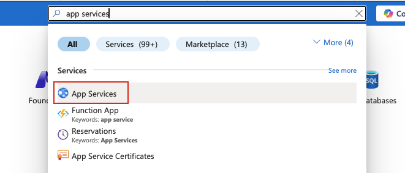
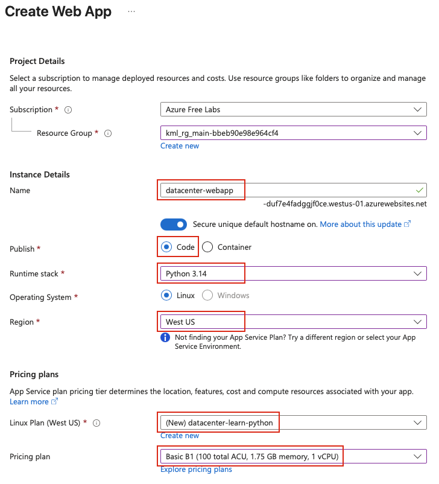
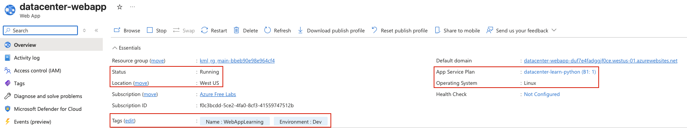

## Task: Deploying and Managing a Web Application
The Nautilus DevOps team is tasked with deploying a Python-based web application on Azure. You need to create a web app using the following specifications:

1. The Web App name should be `datacenter-webapp`.
2. It should be created in the West US region under the default resource group.
3. The publish option should be set to `Code`.
4. The Runtime Stack should be `Python` with `Linux` as the operating system.
5. Create a new App Service Plan named `datacenter-learn-python` with the SKU `Basic B1`.
6. Application Insights should be disabled.
7. Add tags:
   - Name: WebAppLearning
   - Environment: Dev

Make sure the web app is in `Running` state after creation.

---

## Solution

### **Step 1: Log in to Azure Portal**
Go to the Azure Portal:  
https://portal.azure.com  
Sign in with the credentials provided.

### **Step 2: Search for App Services**
- In the top search bar, type **App Services**
- Select **App Services** from the list  

### **Step 3: Create New Web App**
- Click **+ Create**
- Select **Web App** from the dropdown

### **Step 4: Configure Basic Settings**
**Project Details:**
- **Resource Group:** Select the default resource group

**Instance Details:**
- **Name:** `datacenter-webapp`
- **Publish:** `Code`
- **Runtime stack:** `Python` 
- **Operating System:** `Linux`
- **Region:** `West US`  

**Pricing Plans:**
- **Linux Plan (West US):** Click **Create new**
- **Name:** `datacenter-learn-python`
- **Pricing plan:** Click **Explore pricing plans**
- Select **Basic B1**  

### **Step 7: Configure Monitoring Settings**
**Monitoring Tab:**
- **Enable Application Insights:** `No`

### **Step 8: Add Tags**
**Tags Tab:**
- **Name (tag name):** `Name`
- **Value:** `WebAppLearning`
- **Name (tag name):** `Environment`
- **Value:** `Dev`

### **Step 9: Review and Create**
Leave other options as default and review all the settings:
- **Web App name:** `datacenter-webapp`
- **Region:** `West US`
- **Publish:** `Code`
- **Runtime stack:** `Python` (Linux)
- **App Service Plan:** `datacenter-learn-python` (Basic B1)
- **Application Insights:** `Disabled`
- **Tags:** Name=WebAppLearning, Environment=Dev

Click **Create**

### **Step 10: Verify Web App Creation**
Once on the Web App overview page, verify:

- **Status:** `Running` 
- **Name:** `datacenter-webapp`
- **Location:** `West US`
- **Resource group:** Your default resource group
- **App Service plan:** `datacenter-learn-python`
- **Verify the tags**  

