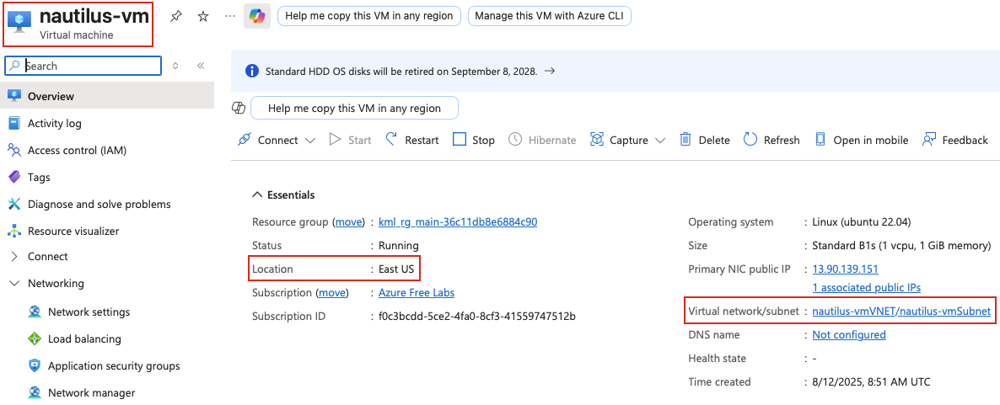
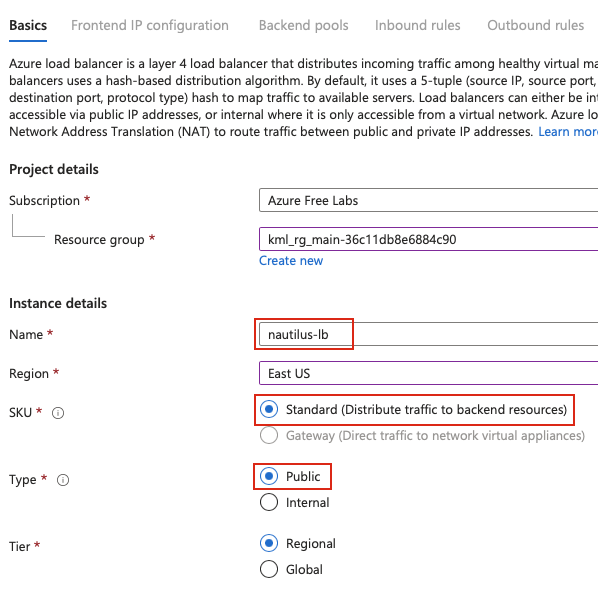
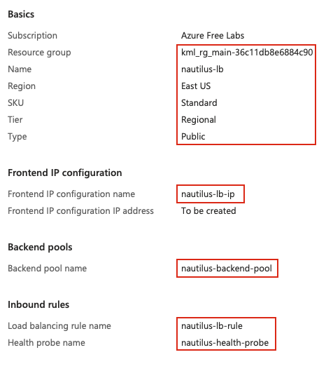
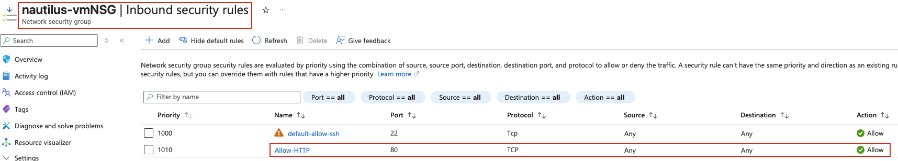
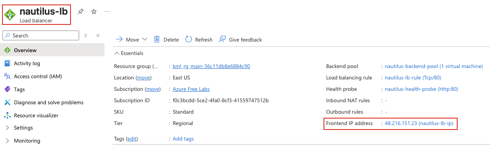

## Task: Integrating Virtual Machines with Application Load Balancer
The Nautilus DevOps team is currently working on setting up a simple application on the Azure cloud. They aim to establish an Azure Load Balancer in front of a Virtual Machine (VM) where an Nginx server is currently running. While the Nginx server currently serves a sample page, the team plans to deploy the actual application later.

1. Set up an Azure Load Balancer named `nautilus-lb`.
2. Configure the Load Balancer's frontend IP configuration with the name `nautilus-lb-ip` and assign a public IP address with the same name (`nautilus-lb-ip`).
3. Create a backend pool named `nautilus-backend-pool` and add the VM running Nginx to this pool.
4. Create a health probe named `nautilus-health-probe` on port `80` to check the VM's health.
5. Set up a load balancer rule named `nautilus-lb-rule` to route traffic on port `80` to the backend pool on port `80`.
6. Add an inbound rule to the existing NSG of the VM to allow HTTP traffic on port `80`.

---

## Solution

### **Step 1: Log in to Azure Portal**
Go to the Azure Portal:  
https://portal.azure.com  
Sign in with the credentials provided.

### **Step 2: Identify the Existing VM**
Before creating the load balancer, identify the VM running Nginx:
- In the search bar, type **Virtual machines**
- Select **Virtual machines** from the list
- Note the VM name, resource group, and region (you'll need these details)
- Click on the VM to view its details
- Note the **Virtual network** and **Subnet** the VM is in  

### **Step 3: Create Public IP Address**
First, create the public IP address for the load balancer frontend:
- In the search bar, type **Public IP addresses**
- Select **Public IP addresses**
- Click **+ Create**

**Create public IP address:**
- **Resource group:** Select the same resource group as your VM
- **Region:** Select the same region as your VM
- **Name:** `nautilus-lb-ip`
- **IP Version:** `IPv4`
- **SKU:** `Standard` 
- **Tier:** `Regional`

Click **Review + create** → **Create**

### **Step 4: Search for Load Balancers**
- In the top search bar, type **Load balancers**
- Select **Load balancers** from the list

### **Step 5: Create New Load Balancer**
- Click **+ Create**

### **Step 6: Configure Load Balancer Basics**
**Basics Tab:**

**Project details:**
- **Resource group:** Select the same resource group as your VM

**Instance details:**
- **Name:** `nautilus-lb`
- **Region:** Select the same region as your VM 
- **SKU:** `Standard`
- **Type:** `Public`
- **Tier:** `Regional`  

### **Step 7: Configure Frontend IP**
**Frontend IP configuration Tab:**

- Click **+ Add a frontend IP configuration**

**Add frontend IP configuration:**
- **Name:** `nautilus-lb-ip`
- **IP version:** `IPv4`
- **IP type:** `IP address`
- **Public IP address:** Select `nautilus-lb-ip` (the one created earlier)

### **Step 8: Configure Backend Pool**
**Backend pools Tab:**

- Click **+ Add a backend pool**

**Add backend pool:**
- **Name:** `nautilus-backend-pool`
- **Virtual network:** Select the virtual network where your VM is located
- **Backend Pool Configuration:** `NIC`
- **IP Version:** `IPv4`

**Virtual machines:**
- Click **+ Add** under Virtual machines
- Select your VM running Nginx by checking the checkbox
- Click **Add**

### **Step 9: Configure Load Balancing Rule**
**Inbound rules Tab:**

Under **Load balancing rules** section:
- Click **+ Add a load balancing rule**

**Add load balancing rule:**
- **Name:** `nautilus-lb-rule`
- **IP Version:** `IPv4`
- **Frontend IP address:** Select `nautilus-lb-ip`
- **Backend pool:** Select `nautilus-backend-pool`
- **Protocol:** `TCP`
- **Port:** `80`
- **Backend port:** `80`
- **Health probe:** Create new
  - **Name:** `nautilus-health-probe`
  - **Protocol:** `HTTP`
  - **Port:** `80`
  - **Path:** `/` (default)
  - **Interval:** `5` (seconds)
- **Session persistence:** `None`
- **Idle timeout (minutes):** `4` (default)

### **Step 10: Review and Create Load Balancer**
Leave other options as default and review all settings:
- **Name:** `nautilus-lb`
- **Frontend IP:** `nautilus-lb-ip`
- **Backend pool:** `nautilus-backend-pool`
- **Health probe:** `nautilus-health-probe`
- **Load balancing rule:** `nautilus-lb-rule`  

Click **Create**

### **Step 11: Add NSG Inbound Rule for HTTP Traffic**
Now, add an inbound rule to the VM's Network Security Group to allow HTTP traffic:
- Go to **Virtual machines**
- Select your VM running Nginx
- In the left menu under **Settings**, click **Networking**
- Click on **Network settings** or the NSG name

### **Step 12: Create Inbound Security Rule**
Once in the NSG:
- In the left menu under **Settings**, click **Inbound security rules**
- Click **+ Add**

**Add inbound security rule:**
- **Source:** `Any`
- **Source port ranges:** `*`
- **Destination:** `Any`
- **Service:** `HTTP`
- **Destination port ranges:** `80` 
- **Protocol:** `TCP`
- **Action:** `Allow`
- **Priority:** `100` 
- **Name:** `Allow-HTTP-80`
- **Description:** `Allow HTTP traffic on port 80`

Click **Add**

### **Step 13: Verify NSG Rule**
Verify the inbound security rule was created:
- You should see `Allow-HTTP-80` in the list of inbound security rules
- **Priority:** 100
- **Port:** 80
- **Protocol:** TCP
- **Action:** Allow  

### **Step 14: Test Load Balancer - Get Public IP**
Go back to the Load Balancer:
- Navigate to **Load balancers** → **nautilus-lb**
- In the **Overview** page, find the **Frontend IP address** 
- Note the **Public IP address** of `nautilus-lb-ip`  

### **Step 15: Test Load Balancer via Browser**
Open a web browser and you should see the default nginx page.