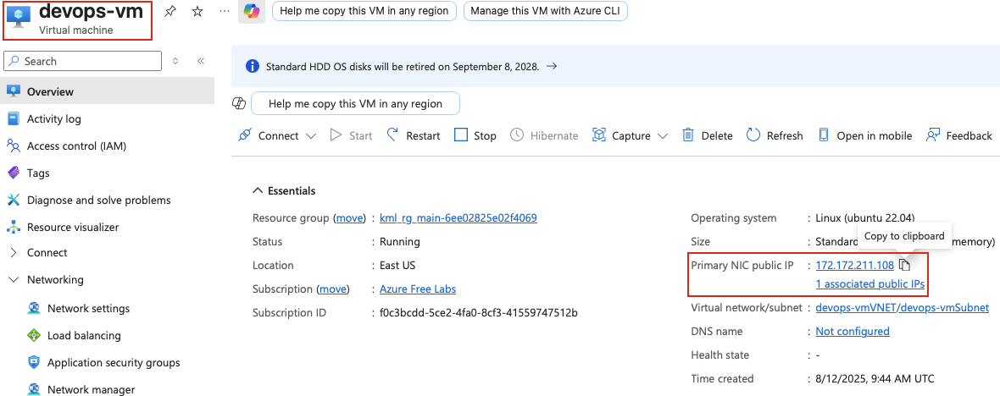
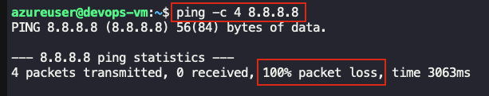
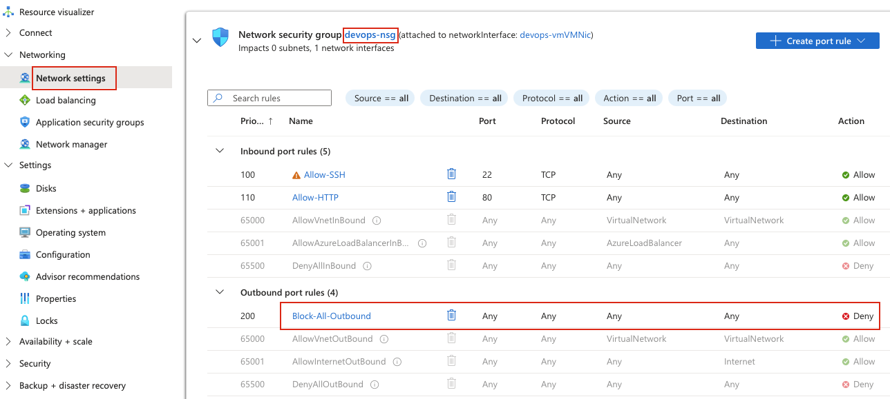
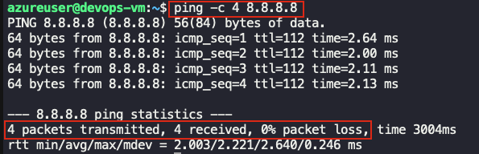

## Task: Enabling Internet Connectivity for Virtual Machines
The Nautilus DevOps team has encountered an issue with an Azure VM named `devops-vm`. They are unable to install any packages on this VM due to connectivity issues. The team needs to identify the root cause of the problem and resolve it to restore normal operations.

1. Investigate the connectivity issue preventing package installation on the Azure VM `devops-vm`.
2. Implement a solution to resolve the connectivity issue and restore package installation capabilities on the VM.

**Note:** The SSH key required to access the Azure VM is already created and added to the VM's authorized keys. You can find the SSH key at `/root/.ssh/id_rsa` on the `azure-client` host.

---

## Solution

### **Step 1: Log in to Azure Portal**
Go to the Azure Portal:  
https://portal.azure.com  
Sign in with the credentials provided.

### **Step 2: Locate the VM**
- In the search bar, type **Virtual machines**
- Select **Virtual machines** from the list
- Find and click on **devops-vm**

### **Step 3: Get VM Public IP Address**
On the VM overview page:
- Note the **Public IP address** of the VM  


### **Step 4: Attempt SSH Connection from azure-client**
From the `azure-client` host, try to SSH into the VM:
```bash
# Attempt SSH connection
ssh -i /root/.ssh/id_rsa azureuser@<vm_public_IP>
```

You should to able to connect to the VM via SSH.

### **Step 5: Initial Connectivity Test**
Once connected to the VM, test basic connectivity:
```bash
# Test DNS resolution
nslookup google.com

# Test internet connectivity
ping -c 4 8.8.8.8
```


Seems to be some issue with internet connectivity. There can many reasons for it, one of which is Security Group rules.

### **Step 6: Investigate Network Security Group (NSG)**
In Azure Portal:
- Go to **Virtual machines** → **devops-vm**
- In the left menu under **Settings**, click **Networking** or **Network settings**
- Review the **Network security group** associated with the VM

### **Step 7: Check Outbound Security Rules**
- Click on the dropdown beside **Network Security Group** name
- Review all outbound rules  


**Issue:** There seems to be a **Deny All** outbound rule. Delete that rule.

### **Step 8: Test Connectivity Again**
From the `azure-client` host's terminal test if connectivity is restored:
```bash
ping -c 4 8.8.8.8
```


Should be successful now.

### **Step 9: Update Package Lists**
Try updating the package lists:
```bash
sudo apt update
```

### **Step 10: Install a Test Package**
Verify package installation works:
```bash
# Install a small test package
sudo apt install -y net-tools
```
