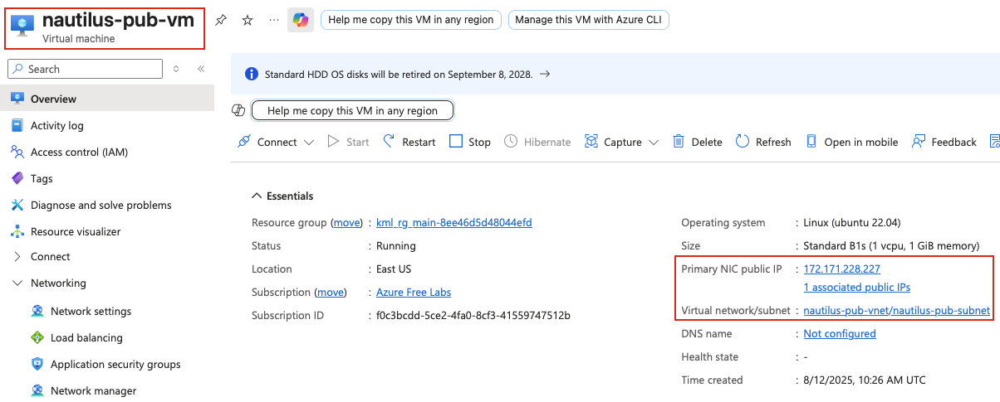
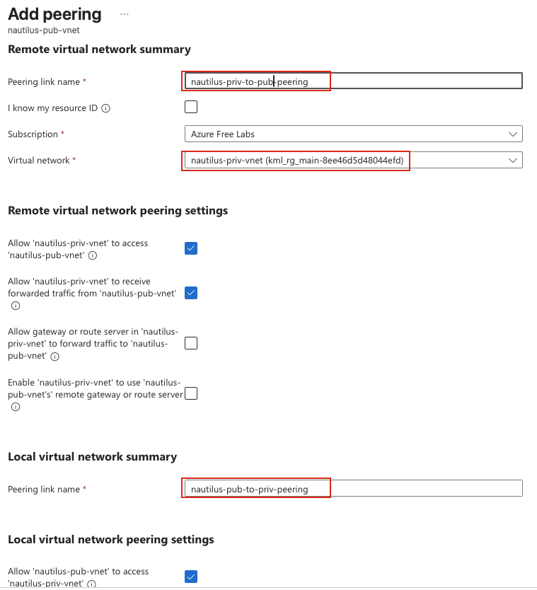
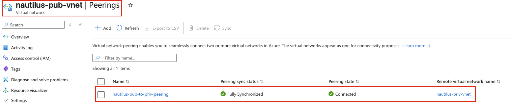
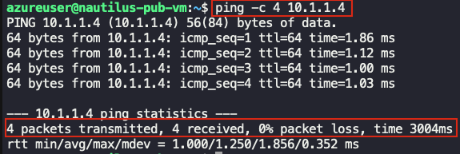

## Task: Configuring Virtual Network Peering
The Nautilus DevOps team has been tasked with demonstrating the use of VNet Peering to enable communication between two VNets. One VNet will be a private VNet that contains a private Azure VM, while the other will be a public VNet containing a publicly accessible Azure VM.

1. Existing Azure Resources:
    - Public VM: `nautilus-pub-vm` is already in the public VNet.
    - Private VNet and VM: `nautilus-priv-vnet` and `nautilus-priv-vm` exist in the private VNet with its subnet: `nautilus-priv-subnet`.
2. Create VNet Peering:
    - Create a VNet Peering between the Public VNet and Private VNet.
    - VNet Peering Name: `nautilus-pub-to-priv-peering`.
3. Test the Connection:
    - SSH into the public VM and verify that you can ping the private VM.


---

## Solution

### **Step 1: Log in to Azure Portal**
Go to the Azure Portal:  
https://portal.azure.com  
Sign in with the credentials provided.

### **Step 2: Identify the Public VNet**
First, locate the public VNet where `nautilus-pub-vm` resides:
- In the search bar, type **Virtual machines**
- Select **Virtual machines**
- Click on **nautilus-pub-vm**
- In the Overview page, note the **Virtual network/subnet** information



### **Step 3: Verify Private VNet Details**
Locate and verify the private VNet details:
- In the search bar, type **Virtual networks**
- Select **Virtual networks**
- Click on **nautilus-priv-vnet**
- Note the **Address space** (e.g., `10.1.0.0/16`)
- Note the **Resource group**
- Verify the subnet **nautilus-priv-subnet** exists

### **Step 4: Get Private VM IP Address**
Get the private IP address of the private VM:
- Go to **Virtual machines**
- Click on **nautilus-priv-vm**
- In the Overview page, note the **Private IP address** (e.g., `10.1.1.4`)
- Note that there is **no Public IP address** (this is expected for a private VM)

### **Step 5: Verify Address Spaces Don't Overlap**
Ensure the VNets have non-overlapping address spaces:
**Example:**
- Public VNet: `10.2.0.0/16` (addresses 10.2.0.0 - 10.2.255.255)
- Private VNet: `10.1.0.0/16` (addresses 10.1.0.0 - 10.1.255.255)

These ranges do not overlap, which is required for VNet peering.  
**Note:** If address spaces overlap, VNet peering will fail. They must be unique.

### **Step 6: Navigate to Public VNet**
Go back to the Public VNet to create the peering:

- Search for **Virtual networks**
- Click on the **Public VNet** (where `nautilus-pub-vm` is located)

### **Step 7: Create VNet Peering from Public to Private**
- In the left menu under **Settings**, click **Peerings**
- Click **+ Add**  


### **Step 8: Configure Peering Settings**
**Local virtual network summary:**
- **Peering link name:** `nautilus-pub-to-priv-peering`

**Local virtual network peering settings:**
- **Allow traffic to remote virtual network:** `Enabled` (checked)
- **Allow traffic forwarded from remote virtual network:** `Enabled` (checked)

**Remote virtual network summary:**
- **Peering link name:** `nautilus-priv-to-pub-peering` (auto-generated or custom)

**Remote virtual network:**
- **Virtual network deployment model:** `Resource Manager`
- **I know my resource ID:** Leave unchecked
- **Virtual network:** Select **nautilus-private-vnet**

**Remote virtual network peering settings:**
- **Allow traffic to remote virtual network:** `Enabled` (checked)
- **Allow traffic forwarded from remote virtual network:** `Enabled` (checked)  


Click **Add**

### **Step 9: Wait for Peering to Complete**
Wait for the peering to be created (typically 30-60 seconds).  
The peering status will change from **Updating** to **Connected**.  


### **Step 10: SSH into Public VM from azure-client**
From the `azure-client` host, SSH into the public VM:
```bash
# SSH into the public VM
ssh -i /root/.ssh/id_rsa azureuser@<public-vm-public-ip>
```

### **Step 11: Test Connectivity - Ping Private VM**
Once connected to the public VM, test connectivity to the private VM:
```bash
# Test ping to private VM
ping -c 4 <private-vm-private-ip> # e.g., 10.1.1.4
```


**Expected result:** You should receive successful ping responses from the private VM.
