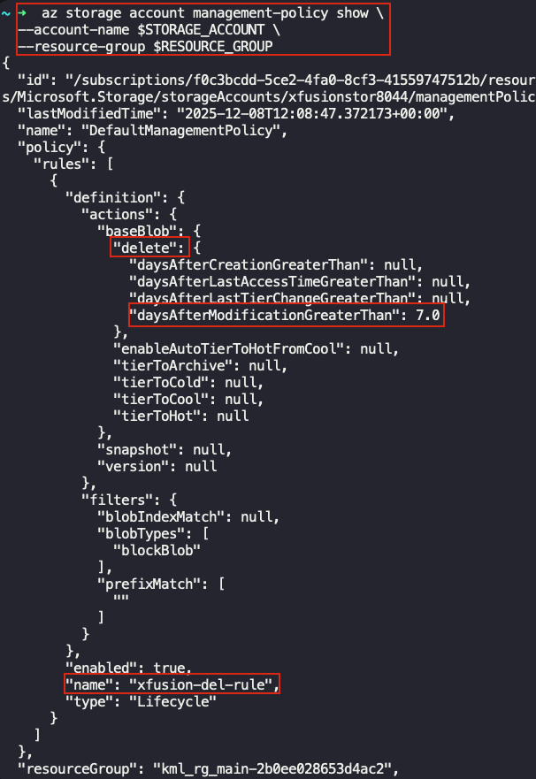

## Task: Managing Storage Lifecycle in Azure
The Nautilus DevOps team needs to optimize data retention costs by automating the deletion of old blobs. They plan to implement Blob Lifecycle Management for a specific container in Azure Storage. 
Task: 
1. Create a Storage Account: 
    - Name the storage account `xfusionstor8044`. Set the region to `East US`. Use `Locally-redundant storage` (LRS) as the redundancy option. 
2. Create a Blob Container: 
    - Name the container `xfusion-container8044`. 
3. Upload a File to the Container: 
    - Upload the file named `tempfile.txt` to the container. The file is present under `/root` of the client host. 
4. Configure Blob Lifecycle Management: 
    - Apply a Lifecycle Management rule named `xfusion-del-rule` to the container `xfusion-container8044` to delete blobs after `7` days of last modification. 
5. Validation: 
    - Verify that the Lifecycle Management rule named `xfusion-del-rule` is correctly applied.

---

## Solution

We'll be performing this task using Azure CLI.

### **Step 1: Set Variables**
Define variables for easier management:
```bash
RESOURCE_GROUP=$(az group list --query "[0].name" -o tsv)
STORAGE_ACCOUNT="xfusionstor8044"
CONTAINER="xfusion-container8044"
FILE_NAME="tempfile.txt"
```

### **Step 2: Create Storage Account**
```bash
az storage account create \
  --name $STORAGE_ACCOUNT \
  --resource-group $RESOURCE_GROUP \
  --location "East US" \
  --sku Standard_LRS
```

### **Step 3: Create Blob Container**
```bash
az storage container create \
  --name $CONTAINER \
  --account-name $STORAGE_ACCOUNT
```

### **Step 4: Upload File to Container**
```bash
az storage blob upload \
  --account-name $STORAGE_ACCOUNT \
  --container-name $CONTAINER \
  --name $FILE_NAME \
  --file /root/tempfile.txt
```

### **Step 5: Create a JSON policy file**
```bash
cat <<EOF > lifecycle.json
{
  "rules": [
    {
      "enabled": true,
      "name": "xfusion-del-rule",
      "type": "Lifecycle",
      "definition": {
        "actions": {
          "baseBlob": {
            "delete": { "daysAfterModificationGreaterThan": 7 }
          }
        },
        "filters": {
          "blobTypes": ["blockBlob"]
        }
      }
    }
  ]
}
EOF
```

### **Step 6: Apply rule to Storage Account**
```bash
az storage account management-policy create \
  --account-name $STORAGE_ACCOUNT \
  --resource-group $RESOURCE_GROUP \
  --policy @lifecycle.json
```

### **Step 7: Validate Lifecycle Rule**
```bash 
az storage account management-policy show \
  --account-name $STORAGE_ACCOUNT \
  --resource-group $RESOURCE_GROUP
```
