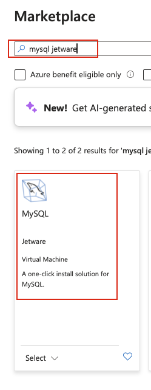
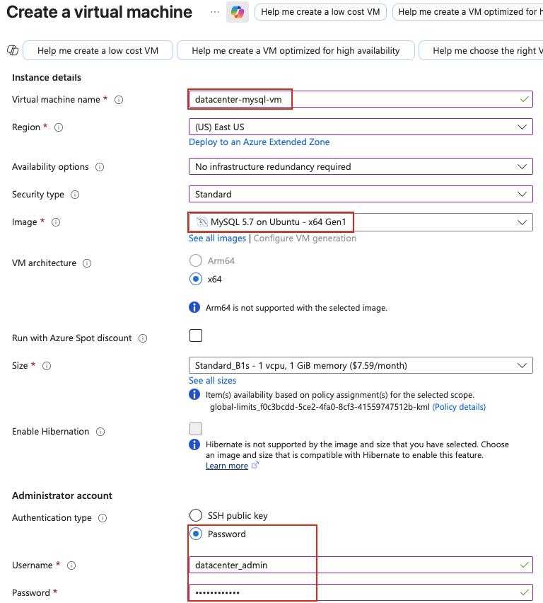
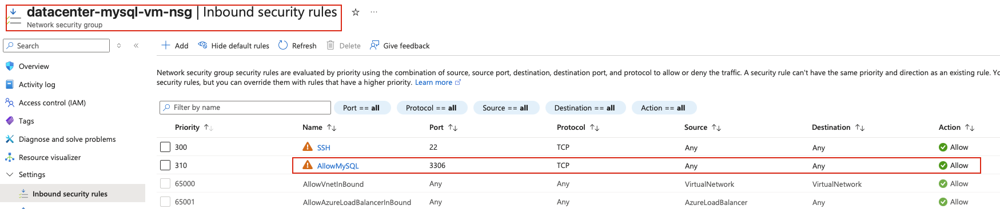

## Task: Setting Up MySQL on a Virtual Machine in Azure
The Nautilus DevOps team is tasked with integrating a PHP application hosted on an Azure VM with a MySQL database hosted on another Azure VM. This will validate the application's ability to connect to the database in the cloud.

1. Create the MySQL VM:
   - Create a VM named `datacenter-mysql-vm` using the MySQL Jetware image from the Azure Marketplace.
   - Configure the VM in the East US region.
   - Use `Password` as the authentication type.
   - Set the username as `datacenter_admin` and the password as `Namin@123456`.
   - Allow inbound traffic on port `3306` to enable MySQL access.

2. Setup the MySQL Database:
   - SSH into the `datacenter-mysql-vm`.
   - Use the `sudo /jet/enter mysql` command to access the MySQL shell.
   - Create a database named `datacenter_db`.
   - Create a MySQL user named `datacenter_user` with password `password123`.
   - Grant all privileges on the `datacenter_db` database to this user.

3. PHP VM Setup:
   - A VM named `datacenter-php-vm` already exists in the East US region.
   - This VM is hosting a PHP application and contains a pre-existing `db_test.php` file in the `/var/www/html/` directory.

4. Database Connection Configuration:
   - Retrieve the public IP address of the `datacenter-mysql-vm`.
   - Update the database connection settings in the `db_test.php` file to use the MySQL credentials and public IP address of the `datacenter-mysql-vm`.

5. Validation:
   - Access the `db_test.php` file from the `datacenter-php-vm` using its public IP address.
   - Ensure the file displays the message `Connected successfully`, confirming the connection between the PHP application and the MySQL database.

---

## Solution

### **Step 1: Log in to Azure Portal**
Go to the Azure Portal:  
https://portal.azure.com  
Sign in with the credentials provided.

### **Step 2: Create VM with MySQL Image from Marketplace**
- In the VM creation page, under **Image**, click **See all images**
- In the search box, type **MySQL Jetware** or **MySQL**
- Look for **MySQL Server by Jetware** or similar MySQL marketplace image
- Select the MySQL image from Jetware  


### **Step 3: Configure MySQL VM Basics**
**Basics Tab:**

**Project details:**
- **Resource group:** Select existing resource group (same as PHP VM)

**Instance details:**
- **Virtual machine name:** `datacenter-mysql-vm`
- **Region:** `East US`
- **Security type:** `Standard` 
- **Image:** Select `MySQL Server by Jetware`
- **VM architecture:** `x64`
- **Size:** Select appropriate size (e.g., `Standard_B1s` or `Standard_1s`)

**Administrator account:**
- **Authentication type:** `Password`
- **Username:** `datacenter_admin`
- **Password:** `Namin@123456`
- **Confirm password:** `Namin@123456`  


### **Step 4: Configure Disks**
**Disks Tab:**
- **OS disk type:** `Standard SSD` 
- Leave other options as default

### **Step 5: Review and Create MySQL VM**
Review all settings:
- **VM name:** `datacenter-mysql-vm`
- **Region:** `East US`
- **Authentication:** Password
- **Username:** `datacenter_admin`
- **Inbound ports:** SSH (22) (we'll later add inbound rule for mysql access)

Click **Create**

### **Step 6: Get MySQL VM Public IP**
On the MySQL VM overview page:
- Note the **Public IP address** (you'll need this later)
- Note the **Private IP address**

### **Step 7: Edit NSG Rules for MySQL Port access**
**Add inbound security rule:**
- **Source:** `Any` 
- **Source port ranges:** `*`
- **Destination:** `Any`
- **Service:** `MySQL` 
- **Destination port ranges:** `3306`
- **Protocol:** `TCP`
- **Action:** `Allow`
- **Priority:** `300`
- **Name:** `AllowMySQL`  


### **Step 8: SSH into MySQL VM**
From `azure-client` host:
```bash
# SSH into MySQL VM
ssh datacenter_admin@<MYSQL_VM_public_IP>
```

When prompted, enter password: `Namin@123456`

### **Step 9: Access MySQL Shell Using Jetware Command**
Use the Jetware-specific command to enter MySQL:
```bash
# Enter MySQL shell using Jetware command
sudo /jet/enter mysql
```

You should now be in the MySQL shell (prompt shows `mysql>`).

### **Step 10: Create Database**
Create the database `datacenter_db`:
```sql
-- Create database
CREATE DATABASE datacenter_db;

-- Verify database was created
SHOW DATABASES;
```

### **Step 11: Create MySQL User**
Create the user `datacenter_user` with password `password123`:
```sql
-- Create user (accessible from any host)
CREATE USER 'datacenter_user'@'%' IDENTIFIED BY 'password123';

-- Verify user was created
SELECT User, Host FROM mysql.user WHERE User='datacenter_user';
```

**Note:** Using `'%'` allows the user to connect from any IP address. For better security in production, use the specific IP of the PHP VM.

### **Step 12: Grant Privileges**
Grant all privileges on `datacenter_db` to `datacenter_user`:
```sql
-- Grant all privileges on datacenter_db
GRANT ALL PRIVILEGES ON datacenter_db.* TO 'datacenter_user'@'%';

-- Flush privileges to apply changes
FLUSH PRIVILEGES;

-- Verify grants
SHOW GRANTS FOR 'datacenter_user'@'%';
```

### **Step 13: SSH into PHP VM**
From `azure-client` host:
```bash
# SSH into PHP VM
ssh azureuser@<PHP_VM_public_IP>
```

### **Step 14: Edit db_test.php file**
Make sure to edit the following details in the `/var/www/html/db_test.php` file:
  - **servername** = "<mysql-vm-public-ip>";
  - **username** = "datacenter_user";
  - **password** = "password123";
  - **database** = "datacenter_db";

### **Step 15: Validation**
Test the connection between the PHP application and the MySQL database.  
From **PHP VM** host:
```bash
php /var/www/html/db_test.php 
```

Expected output:
**Connected successfully**
