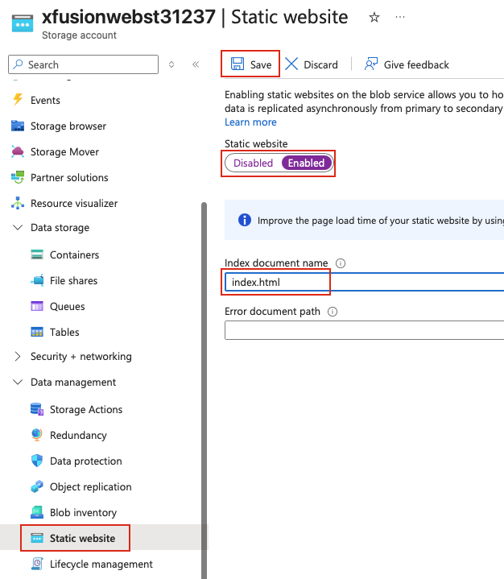
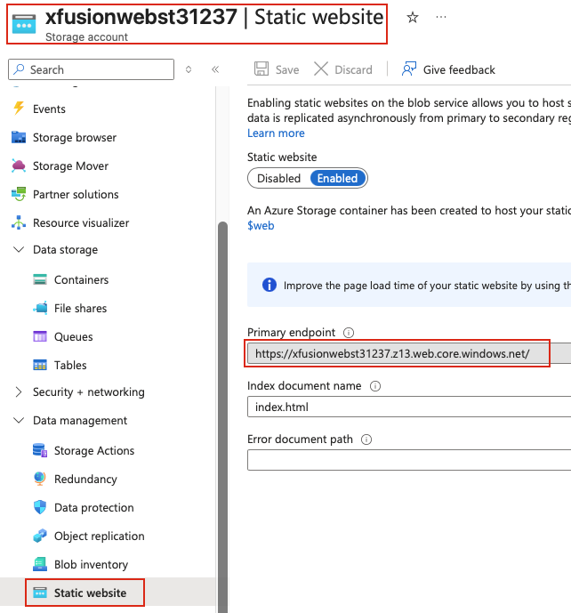
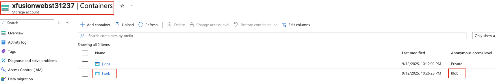

## Task: Deploying a Static Website Using Containers on Azure
The Nautilus DevOps team has been tasked with creating an internal information portal for public access. As part of this project, they need to host a static website on Azure using an Azure Storage account. The Storage account must be configured for public access to allow external users to access the static website directly via the Azure Storage URL.

**Task Requirements:**

1. Create an Azure Storage account named `xfusionwebst31237` in an existing resource group.
2. Configure the Storage account for static website hosting with `index.html` as the index document.
3. Allow public access to the static website so that the website is publicly accessible.
4. Upload the `index.html` file from the `/root/` directory of the Azure client host to the Storage account's `$web` container.
5. Verify that the website is accessible directly through the Azure Storage static website URL.

---

## Solution

### **Step 1: Log in to Azure Portal**
Go to the Azure Portal:  
https://portal.azure.com  
Sign in with the credentials provided.

### **Step 2: Create New Storage Account**
Refer to [Day17](Day17.md) to check how to create a public Azure blob storage container.

### **Step 3: Enable Static Website Hosting**
On the storage account page:
- In the left menu under **Data management**, click **Static website**
- **Static website:** Toggle to **Enabled**
- **Index document name:** `index.html`
- **Error document path:** `404.html` (optional, leave blank if you don't have one)  


Click **Save**

### **Step 4: Note the Static Website Endpoints**
After saving, you'll see an important URL:
- **Primary endpoint:** `https://xfusionwebst31237.z13.web.core.windows.net/`  


**Important:** Copy the **Primary endpoint** URL - you'll use this to access your website.

**Note:** The `$web` container is automatically created when you enable static website hosting.

### **Step 5: Verify $web Container Creation**
Verify the `$web` container was created:
- In the left menu under **Data storage**, click **Containers**
- You should see a container named **$web**
- Ensure **Anonymous access level** is set to **Blob (anonymous read access for blobs only)**  


### **Step 6: Upload index.html Using Azure CLI**
From `azure-client` host upload the index.html file to the `$web` container:
```bash
# Navigate to /root directory
cd /root

# Upload index.html to $web container
az storage blob upload \
  --account-name xfusionwebst31237 \
  --container-name '$web' \
  --name index.html \
  --file /root/index.html 
```

### **Step 7: Test Website Access via Browser**
Open a web browser and navigate to the primary endpoint URL copied in Step 4