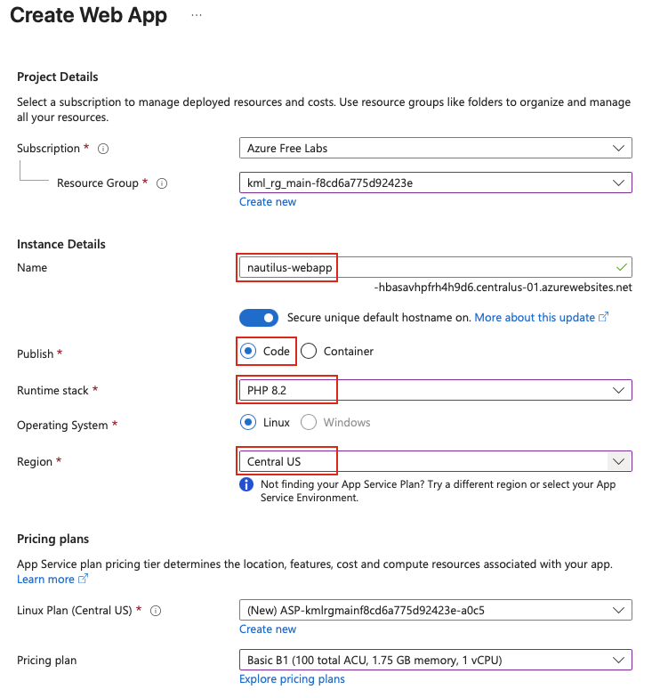
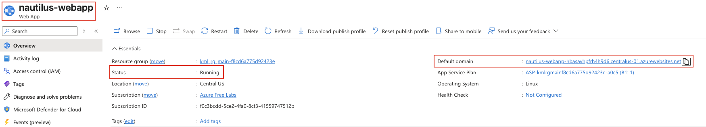
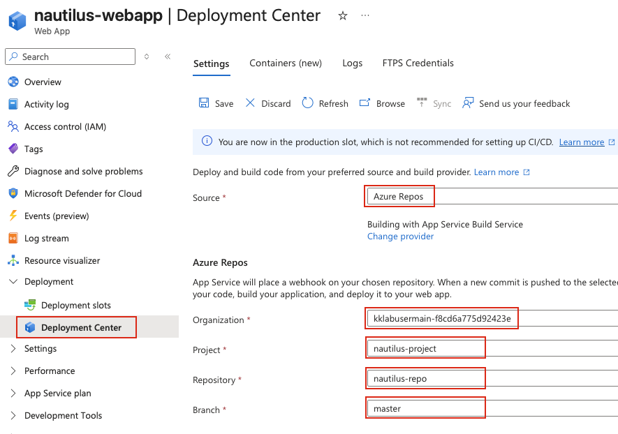
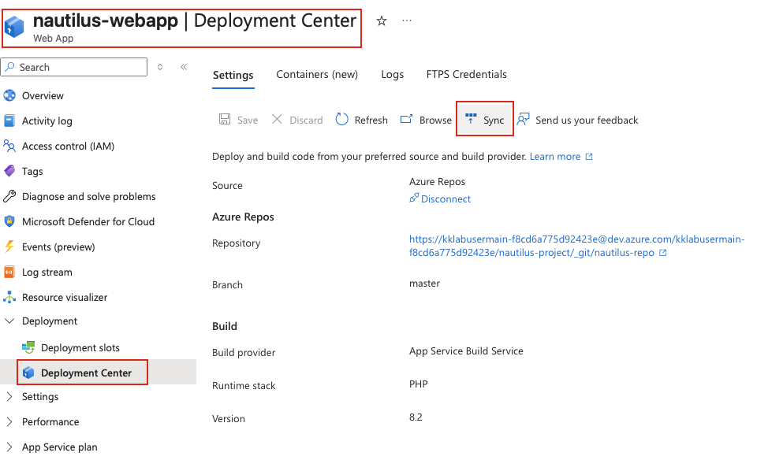

## Task: Deploying a Web Application from Repository on Azure
The Nautilus DevOps team has been tasked with deploying a simple PHP web application on Azure App Service. The team needs to integrate Azure DevOps for version control and push the application code to Azure App Service for deployment.

**Task Requirements:**

1. **Create an Azure App Service:**
   - Name the App Service `nautilus-webapp`
   - Use the following configurations:
     - Runtime Stack: `PHP 8.2`
     - Operating System: `Linux`
     - Region: `Central US`

2. **Integrate Azure DevOps for Code Management:**
   - Create an Azure DevOps repository named `nautilus-repo` in the project `nautilus-project`
   - Add the `root` user's SSH public key from the `azure-client` host to the Azure DevOps SSH keys
   - Configure SSH authentication by creating an SSH config file under `/root/.ssh/config` on the `azure-client` host
   - Clone the repository on the `azure-client` host under `/root`
   - Add the `index.php` file (already present under `/root/webapp`) to the repository. Commit and push the changes to the repository

3. **Deploy the Application:**
   - Use the App Service to deploy the PHP application from the repository
   - Ensure the application is deployed and running correctly.

**Note**: After deployment, wait for some time for the web application to be fully up and running.

---

## Solution

#### **Step 1: Log in to Azure Portal**
Go to the Azure Portal:  
https://portal.azure.com  
Sign in with the credentials provided.

#### **Step 2: Create a New App Service**
- In the Azure Portal, search for **App Services** in the top search bar
- Click **+ Create** to create a new App Service
- Fill in the required details:

**Basics Tab:**
- **Resource group:** Select an existing resource group or create a new one
- **Name:** `nautilus-webapp`
- **Publish:** Select `Code`
- **Runtime stack:** `PHP 8.2`
- **Operating System:** `Linux`
- **Region:** `Central US`

**Pricing Plan:**
- Select an appropriate App Service Plan (e.g., Free F1 or Basic B1)  


4. Click **Review + create**, then click **Create**
5. Wait for the deployment to complete

#### **Step 3: Verify App Service Creation**
Once deployment is complete:
- Click **Go to resource** to navigate to your newly created App Service
- Note the **Default domain** URL  


#### **Step 4: Create Azure DevOps Repository**
Refer to [Day30](Day30.md) on how to setup an Azure DevOps Repository
- Create an Organisation with the default values.
- Later create a new project named `nautilus-project` under it.
- Create a repo named `nautilus-repo` in the project created previously.
- Create an ssh key-pair for `root` user on the `azure-client` host if not already present.
- Add ssh public key to Azure DevOps.

### **Step 5: Clone the repository on `azure-client` host**
On the `azure-client` host, create the SSH config file:
```bash
# Create SSH config file
cat > /root/.ssh/config << 'EOF'
Host ssh.dev.azure.com
  IdentityFile ~/.ssh/id_rsa
  IdentitiesOnly yes
  HostkeyAlgorithms +ssh-rsa
  PubkeyAcceptedKeyTypes +ssh-rsa
EOF
```
Set up Git user configuration:
```bash
# Set Git user name and email
git config --global user.name "Nautilus DevOps"
git config --global user.email "devops@nautilus.com"
```
Clone the repository to `/root`:
```bash
# Navigate to /root directory
cd /root

# Clone the repository (replace with your actual SSH URL)
git clone <git_SSH_URL>
```

### **Step 6: Copy Files from /root/webapp**
Copy the contents of `/root/webapp` directory to the repository:
```bash
# Navigate into the cloned repository
cd nautilus-repo

# Copy all files from /root/pyapp to current directory
cp -r /root/webapp/* .
```

### **Step 7: Add, Commit, and Push Changes**
Add, commit, and push the files to the repository:
```bash
# Add all files to staging
git add .

# Commit changes
git commit -m "Initial commit"

# Push changes to remote repository
git push origin master
```

**Note:** If the default branch is `main` instead of `master`, use:
```bash
git push origin main
```

### **Step 8: Configure Deployment Source in App Service**
- Go back to the Azure Portal and navigate to your `nautilus-webapp` App Service
- In the left menu under **Deployment**, click **Deployment Center**
- Click on **Settings** tab
- Configure the deployment source:
   - **Source:** Select **Azure Repos**
   - **Organization:** Select your Azure DevOps organization
   - **Project:** Select `nautilus-project`
   - **Repository:** Select `nautilus-repo`
   - **Branch:** Select `master` (or `main` depending on your default branch)
- Click **Save**  
 

### **Step 9: Trigger Deployment**
The deployment should start automatically. You can monitor the deployment progress.

If the deployment doesn't start automatically:
- In the **Deployment Center**, click **Sync** to manually trigger a deployment  
 

### **Step 10: Verify Application Deployment**
Once the deployment is complete:
- Go to the **Overview** page of your App Service
- Click on the **Default domain** URL
- Your PHP application should load and display the content from `index.php`
