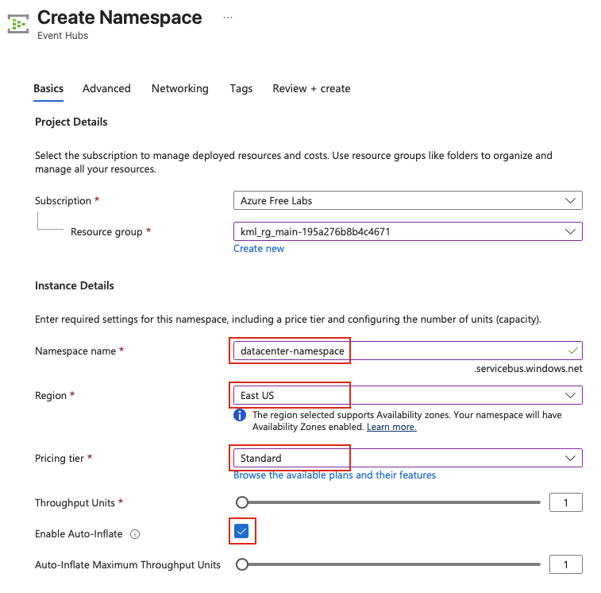
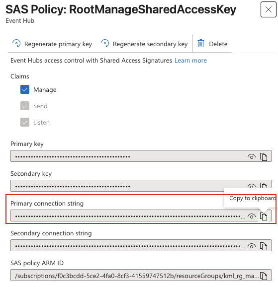
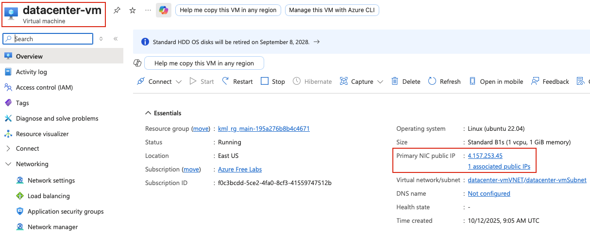
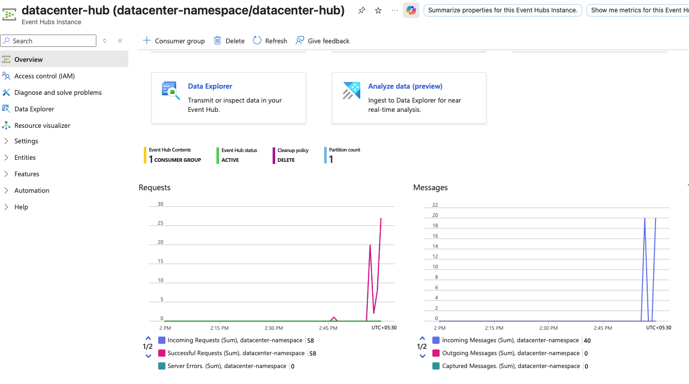

## Task: Integrating Azure Event Hub with Virtual Machines
The Nautilus DevOps team wants to integrate an Azure Virtual Machine with Azure Event Hubs for centralized log collection. Follow these steps to complete the task.

1. **Create Azure Event Hubs Namespace:**
   - Create an Event Hubs namespace named `datacenter-namespace` in the East US region
   - Select the Standard pricing tier. Make sure to enable `Enable Auto-inflate`

2. **Create an Event Hub:**
   - Within the namespace, create an Event Hub named `datacenter-hub`

3. **Verify the Virtual Machine Configuration:**
   - A VM named `datacenter-vm` already exists
   - A Python script named `send_logs.py` already exists on the VM under `/home/azureuser`. This script is used to send logs to the Event Hub. Make sure to execute this script multiple times

4. **Verify Logs:**
   - Ensure the logs are successfully sent to the Event Hub by checking the Event Hubs metrics in the Azure portal

---

## Solution

### **Step 1: Log in to Azure Portal**
Go to the Azure Portal:  
https://portal.azure.com  
Sign in with the credentials provided.

### **Step 2: Create Event Hubs Namespace**
1. In the Azure Portal, search for **Event Hubs** in the top search bar
2. Click **+ Create** to create a new Event Hubs namespace
3. Fill in the required details:

**Basics Tab:**
- **Subscription:** Select your subscription
- **Resource group:** Select an existing resource group or create a new one (e.g., `datacenter-rg`)
- **Namespace name:** `datacenter-namespace`
- **Location:** East US
- **Pricing tier:** Standard
- **Enable Auto-Inflate:** Checked  


4. Click **Review + create**
5. Review the settings and click **Create**
6. Wait for the deployment to complete

### **Step 3: Create Event Hub within Namespace**
- In the `datacenter-namespace` page, click **+ Event Hub** at the top
- Configure the Event Hub:
  - **Name:** `datacenter-hub`
-  Click **Review + create**, then click **Create**

### **Step 4: Get Event Hub Connection String**
The VM's Python script will need a connection string to send logs to the Event Hub.
- Navigate to `datacenter-namespace` (not the Event Hub itself)
- In the left menu under **Settings**, click **Shared access policies**
- Click on **RootManageSharedAccessKey** (default policy)
- Copy the **Primary connection string**  


### **Step 5: Connect to the Virtual Machine**
SSH into the existing `datacenter-vm`:
- Search for **Virtual machines** in the Azure Portal
- Click on `datacenter-vm`
- Copy the public IP of the vm
- From the `azure-client` host:
```bash
ssh azureuser@<VM_public_IP>
```


### **Step 6: Review and Update Python Script**
```bash
# View the contents of the script
cat /home/azureuser/send_logs.py
```
Update the CONNECTION_STRING variable with the connection string from Step 4

**Important:** Make sure to replace placeholder with the actual connection string from Step 4.

### **Step 7: Execute Python Script Multiple Times**
Run the script multiple times to send logs to the Event Hub:
```bash
# Navigate to the script directory
cd /home/azureuser

# Execute multiple times
python3 send_logs.py
python3 send_logs.py
python3 send_logs.py
python3 send_logs.py
```

### **Step 8: Verify in Event Hub Overview**
- Navigate to `datacenter-hub`
- Click on **Overview**
- Look at the **Metrics**
- You should see the number of requests, messages received  
