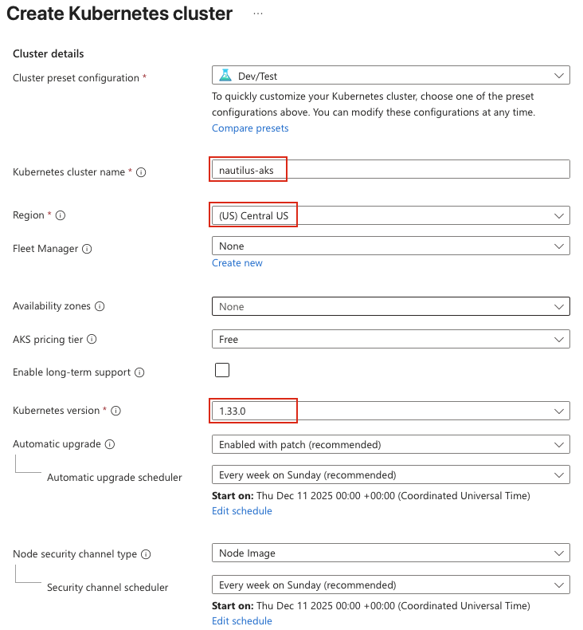
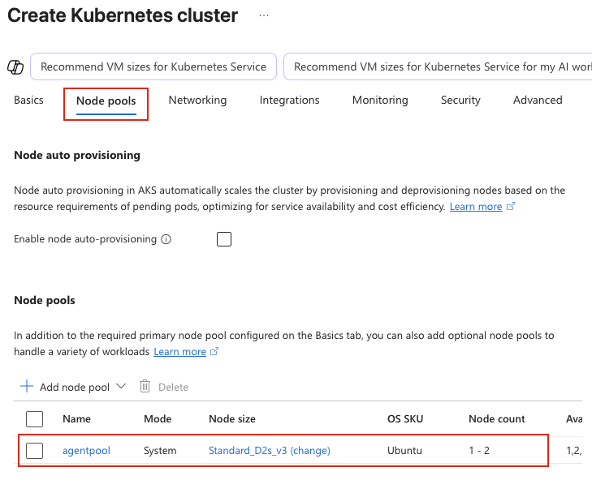
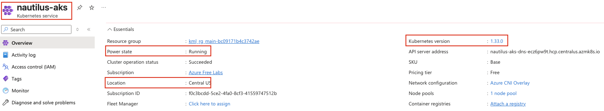

## Task: Azure Kubernetes Service (AKS) Setup and Management
The Nautilus DevOps team is tasked with preparing an AKS cluster to deploy a Kubernetes-based application. The team has the following requirements.

1. Create an AKS cluster named `nautilus-aks`
2. The Kubernetes version must be `1.33.0`
3. The AKS cluster endpoint access must be private
4. Ensure the cluster is created in the `Central US` region
5. Edit the `agentpool` Node pools (delete all other node pool if exists) and configure the cluster with the following properties:
   - Node size: `D2s v3`
   - Minimum node count: `1`
   - Maximum node count: `2`
6. Disable the `Container Insights` for now and disable all kind of monitoring as well

The AKS cluster must be configured with high availability and private endpoint access. Verify that the cluster meets the requirements and is ready for workloads.

---

## Solution

### **Step 1: Log in to Azure Portal**
Go to the Azure Portal:  
https://portal.azure.com  
Sign in with the credentials provided.

### **Step 2: Create AKS Cluster**
- In the Azure Portal, search for **Kubernetes services** in the top search bar
- Click **+ Create** > **Kubernetes cluster**

### **Step 3: Configure Basics Tab**
**Cluster Details:**
- **Kubernetes cluster name:** `nautilus-aks`
- **Region:** Central US
- **Kubernetes version:** `1.33.0`  

**Node pools:**
- **Node pool name:** `agentpool` (default)
- **Node size:** Click **Choose a size**
  - Search for `D2s v3`
  - Select **Standard_D2s_v3** (2 vCPUs, 8 GiB memory)
  - Click **Select**
- **Minimum node count:** `1`
- **Maximum node count:** `2`  

### **Step 4: Configure Networking Tab**
**CRITICAL - Private Cluster Configuration:**
- **Enable private cluster:** Checked (THIS IS REQUIRED)

Leave other options as default

### **Step 5: Review and Create**
Review all settings carefully:
- Cluster name: `nautilus-aks`
- Region: Central US
- Kubernetes version: `1.33.0`
- Private cluster: Enabled
- Node pool: `agentpool` with D2s_v3, min 1, max 2 nodes
- Monitoring: Disabled

Click **Create**

### **Step 6: Wait for Deployment**
AKS cluster deployment typically takes 5-10 minutes. Monitor the deployment progress:

### **Step 7: Navigate to AKS Cluster**
1. Click **Go to resource** to navigate to `nautilus-aks`
2. Review the **Overview** page  

